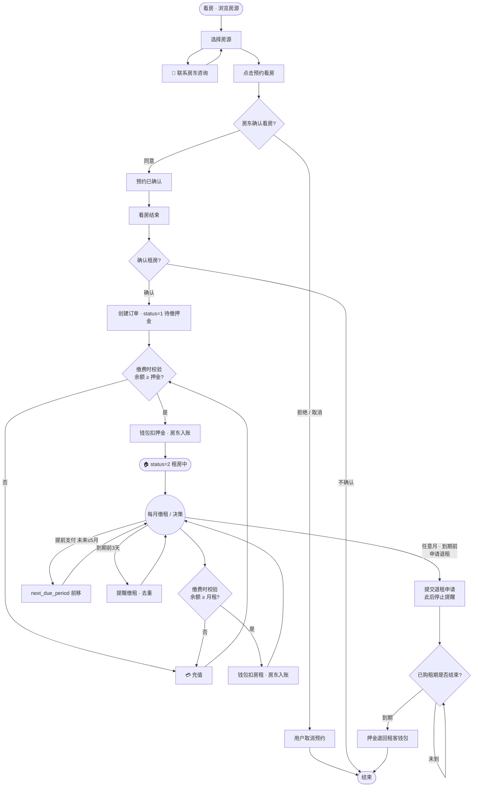
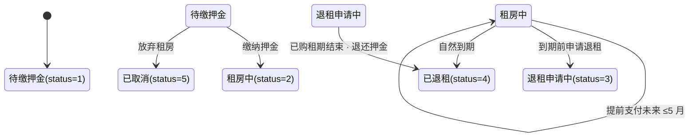
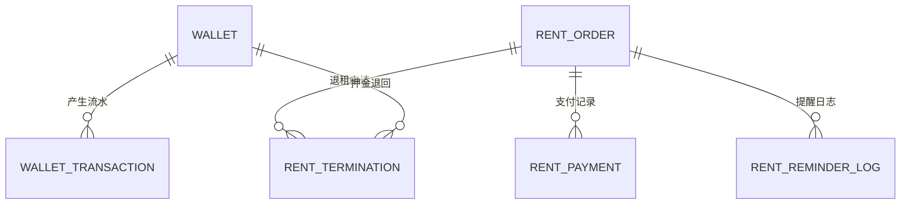

租房流程（主线 + 钱包 + 退租）

主线：看房 → 选择房源 → 点击预约看房 → 房东确认看房 → 看房结束 → 确认租房 → 缴纳押金 → 完成租房(status=2) → 进入租期循环（每月缴租 / 可提前支付未来租金 ≤5个月）

分支：
- 联系房东：选房阶段实时咨询（可回到选房）
- 用户取消预约：预约确认前
- 不确认租房：看房结束后
- 申请退租：租期循环内任意月、到期前均可提交；提交退租申请后「停止提醒」，直到「已购租期结束」才退还押金

规则：
- 钱包余额校验仅在「用户选择缴费」那一刻进行（缴押金 / 缴当月租 / 提前支付）；余额不足先充值再重试
- 提前支付最多 5 个月，支付后 next_due_period 前移，后续提醒自动延后
- 到期提醒：next_due_period 起始日 − 3 天触发（仅「租房中」且未退租时）

---

## 主流程图

> 说明：`RC(充值)` 被「缴押金」「缴租金」两处余额不足时复用；钱包余额校验只在**缴费动作**发生时触发，不是常驻循环判断。

---

## 租房订单状态机

---

## 关键规则说明

| 场景 | 行为 |
|------|------|
| 余额校验 | 仅在用户点「缴押金 / 缴当月租 / 提前支付」时校验；不足 → 先充值 → 再重试 |
| 提前支付 | 单次最多 5 个月，`next_due_period` 前移对应月数，后续提醒自动顺延 |
| 到期提醒 | `next_due_period` 起始日 − 3 天触发（仅租房中、未申请退租），`rent_reminder_log` 去重 |
| 申请退租 | 租期循环内任意月、到期前均可提交；提交后状态 → `退租申请中`，**停止所有提醒与缴费** |
| 押金退回 | 仅当「已购租期结束」时，押金从房东钱包退回租客钱包 |
| 充值 | 当前模拟充值（预留微信支付 `source=WECHAT_PAY`） |
| 提现 | 扣减余额，状态=处理中（预留微信零钱到账），租客/房东通用 |

---

# 数据库表设计

> 说明：原 12 张表（`landlord` / `tenant` / `house` / `appointment` 等）**保持不变**。本流程新增 **6 张表**（钱包体系 + 房租订单体系）。
> 资金流：用户缴押金/房租 → 扣「租客钱包」→ 入「**对应房源的房东钱包**」（两笔流水 `peer` 关联 + 同一 `biz_no`）；退租到期，押金由房东钱包**原路退回**租客钱包。
> 设计原则：**余额变更必须与流水同事务**；钱包余额校验仅在缴费动作发生时进行；状态用 `status` + 关联子表记录细节。

---

## 表关系总览

---

## 1. `wallet` — 用户钱包（租客 / 房东共用）

**作用**：每个用户一个钱包账户，保存当前余额。租客用它**付费**（押金/房租），房东用它**收钱 + 提现**。租客与房东靠 `user_type` 区分，互不影响。

| 字段 | 类型 | 约束 | 说明 |
|------|------|------|------|
| `id` | BIGINT | PK, AUTO_INCREMENT | 主键 |
| `user_type` | VARCHAR(10) | NOT NULL | 账户归属类型：`tenant` / `landlord` |
| `user_id` | BIGINT | NOT NULL | 账户归属用户 ID（对应 tenant.id / landlord.id） |
| `balance` | DECIMAL(12,2) | DEFAULT 0 | 当前余额（单位为元，2 位小数） |
| `status` | TINYINT | DEFAULT 1 | 账户状态：1 正常 / 0 冻结 |
| `create_time` | DATETIME | DEFAULT CURRENT_TIMESTAMP | 创建时间 |
| `update_time` | DATETIME | DEFAULT CURRENT_TIMESTAMP ON UPDATE CURRENT_TIMESTAMP | 更新时间 |

> **唯一索引**：`uk_user(user_type,user_id)` —— 一个用户只对应一个钱包。

---

## 2. `wallet_transaction` — 钱包流水（双向记账）

**作用**：记录钱包里的每一笔余额变动明细（充值/提现/押金/租金，收入或支出），用于**对账与审计**。押金/房租由「租客出 → 房东收」构成一对 `peer` 流水，便于追溯同一笔钱。

| 字段 | 类型 | 约束 | 说明 |
|------|------|------|------|
| `id` | BIGINT | PK, AUTO_INCREMENT | 主键 |
| `wallet_id` | BIGINT | NOT NULL, *FK→wallet* | 产生流水的钱包 |
| `user_type` | VARCHAR(10) | NOT NULL | 用户类型（冗余，便于按用户查询） |
| `user_id` | BIGINT | NOT NULL | 用户 ID（冗余，便于按用户查询） |
| `biz_type` | VARCHAR(30) | NOT NULL | 业务类型：`RECHARGE` 充值 / `WITHDRAW` 提现 / `DEPOSIT_PAY` 租客缴押金 / `DEPOSIT_INCOME` 房东收押金 / `DEPOSIT_REFUND` 押金退回 / `RENT_PAY` 租客缴租 / `RENT_INCOME` 房东收租 |
| `amount` | DECIMAL(12,2) | NOT NULL | 金额（**恒正数**，方向由 `direction` 表达） |
| `direction` | TINYINT | NOT NULL | 方向：1 收入（+）/ −1 支出（−） |
| `balance_after` | DECIMAL(12,2) | NOT NULL | 交易后的余额快照（用于对账） |
| `source` | VARCHAR(20) | DEFAULT 'SIMULATE' | 资金来源：`SIMULATE` 模拟 / `WECHAT_PAY` 微信支付（后期） |
| `status` | TINYINT | DEFAULT 1 | 1 成功 / 0 处理中（提现待打款）/ 2 失败 |
| `biz_no` | VARCHAR(32) | | 业务单号：关联 `rent_payment` 或充值/提现单，用于串联 |
| `peer_txn_id` | BIGINT | *FK*, NULL | 对端流水 ID：租客 `DEPOSIT_PAY` ↔ 房东 `DEPOSIT_INCOME`，**同笔转账双端关联** |
| `remark` | VARCHAR(200) | | 备注 |
| `create_time` | DATETIME | DEFAULT CURRENT_TIMESTAMP | 创建时间 |

> **索引**：`idx_user(user_type,user_id)`、`idx_biz(biz_no)`。

---

## 3. `rent_order` — 租房订单（主单）

**作用**：缴纳押金后生成的**租房契约主单**，绑定租客/房源/房东，记录押金、月租、起租日、状态机与缴费进度。

| 字段 | 类型 | 约束 | 说明 |
|------|------|------|------|
| `id` | BIGINT | PK, AUTO_INCREMENT | 主键 |
| `order_no` | VARCHAR(32) | NOT NULL, **UNIQUE** | 订单号（业务可读） |
| `appointment_id` | BIGINT | *FK→appointment*, NULL | 来源预约（看房预约） |
| `tenant_id` | BIGINT | NOT NULL, *FK→tenant* | 租客 |
| `house_id` | BIGINT | NOT NULL, *FK→house* | 房源 |
| `landlord_id` | BIGINT | NOT NULL, *FK→landlord* | 房东（**房款入账对象**，从 house 带出，不信任前端） |
| `deposit` | DECIMAL(12,2) | NOT NULL | 押金（可退） |
| `monthly_rent` | DECIMAL(12,2) | NOT NULL | 月租金 |
| `status` | TINYINT | DEFAULT 1 | 状态机：1 待缴押金 / 2 租房中 / 3 退租申请中 / 4 已退租 / 5 已取消 |
| `start_date` | DATE | | 起租日 |
| `next_due_period` | VARCHAR(7) | | **下次待缴周期**，如 `2026-10`；提前支付 N 期则前移 N 月 |
| `paid_months` | INT | DEFAULT 0 | 已缴月数（冗余统计） |
| `create_time` | DATETIME | DEFAULT CURRENT_TIMESTAMP | 创建时间 |
| `update_time` | DATETIME | DEFAULT CURRENT_TIMESTAMP ON UPDATE CURRENT_TIMESTAMP | 更新时间 |

> **索引**：`idx_tenant(tenant_id)`、`idx_landlord(landlord_id)`、`idx_house(house_id)`。
> **提醒依据**：`next_due_period` 起始日 − 3 天；退租申请后停止提醒。

---

## 4. `rent_payment` — 租金 / 押金支付记录

**作用**：记录每一笔**实际支付**（押金一笔；租金每月一笔；提前支付则一次生成多笔，各对应一个周期）。同一笔支付串起「租客扣款流水」与「房东入账流水」。

| 字段 | 类型 | 约束 | 说明 |
|------|------|------|------|
| `id` | BIGINT | PK, AUTO_INCREMENT | 主键 |
| `order_id` | BIGINT | NOT NULL, *FK→rent_order* | 所属订单 |
| `pay_type` | VARCHAR(20) | NOT NULL | 支付类型：`DEPOSIT` 押金 / `RENT` 租金 |
| `period` | VARCHAR(7) | | 租金所属周期 `2026-09`（押金记录为空） |
| `amount` | DECIMAL(12,2) | NOT NULL | 支付金额 |
| `pay_method` | VARCHAR(20) | NOT NULL | 支付方式：`WALLET` 钱包 / `WECHAT_PAY` 微信支付（预留） |
| `status` | TINYINT | DEFAULT 1 | 1 成功 / 0 处理中 |
| `biz_no` | VARCHAR(32) | NOT NULL | 业务号：**提前支付 N 期共享同一 biz_no**，区分支付批次 |
| `tenant_txn_id` | BIGINT | *FK→wallet_transaction* | 租客侧钱包流水 id |
| `landlord_txn_id` | BIGINT | *FK→wallet_transaction* | 房东侧钱包流水 id |
| `create_time` | DATETIME | DEFAULT CURRENT_TIMESTAMP | 创建时间 |

> **索引**：`idx_order(order_id)`。**提前支付 N（≤5）个月 → 一次接口生成 N 条 `RENT` 记录**，共享 `biz_no`。

---

## 5. `rent_termination` — 退租申请记录

**作用**：记录用户的**退租申请**、申请时已购租期对应的**生效结束周期**、以及押金退回状态。用于「申请后就停止提醒、等租期结束才退押金」的流程。

| 字段 | 类型 | 约束 | 说明 |
|------|------|------|------|
| `id` | BIGINT | PK, AUTO_INCREMENT | 主键 |
| `order_id` | BIGINT | NOT NULL, *FK→rent_order* | 所属订单 |
| `tenant_id` | BIGINT | NOT NULL | 申请退租的用户 |
| `apply_time` | DATETIME | NOT NULL | 退租申请时间 |
| `effective_end_period` | VARCHAR(7) | NOT NULL | **生效的已购租期末周期**：申请时 `next_due_period` 的上一个周期（用户已买到的那一期） |
| `refund_status` | TINYINT | DEFAULT 0 | 押金退回：0 待退 / 1 已退 |
| `refund_time` | DATETIME | | 押金实际退回时间 |
| `refund_txn_id` | BIGINT | *FK→wallet_transaction* | 押金退回流水 id |
| `remark` | VARCHAR(200) | | 退租原因等备注 |
| `create_time` | DATETIME | DEFAULT CURRENT_TIMESTAMP | 创建时间 |

> **索引**：`idx_order(order_id)`。
> **退租逻辑**：`apply_time` 后停止提醒与缴费；当今天 ≥ `effective_end_period` 周期结束时 → `refund_status=1`，押金由房东钱包退回租客钱包。

---

## 6. `rent_reminder_log` — 房租提醒去重日志

**作用**：定时任务扫描到「应提醒」的订单后，写一条日志，保证**同一订单同一周期同一天只提醒一次**，避免重复推送。

| 字段 | 类型 | 约束 | 说明 |
|------|------|------|------|
| `id` | BIGINT | PK, AUTO_INCREMENT | 主键 |
| `order_id` | BIGINT | NOT NULL, *FK→rent_order* | 被提醒的订单 |
| `remind_period` | VARCHAR(7) | NOT NULL | 提醒针对的待缴周期 |
| `remind_date` | DATE | NOT NULL | 提醒日期 |
| `create_time` | DATETIME | DEFAULT CURRENT_TIMESTAMP | 创建时间 |

> **唯一索引**：`uk_order_period(order_id, remind_period, remind_date)` —— 三字段唯一，天然去重。

---

# API 接口设计

> **鉴权约定**：租客端 `/user/**`，Header `authentication`（JWT），拦截器解析后经 `BaseContext` 注入当前用户（`getCurrentId()` / `getCurrentType()`）。
> **本期范围**：优先实现**租客小程序端**（钱包 + 房租订单）；`controller` 统一返回 `Result<T>`（`code=1` 成功），分页用 `PageResult`。
> **常见响应体**：`Result<Long>` / `Result<PageResult<T>>` / `Result<RentOrderVO>`。

---

## 一、钱包模块 `/user/wallet`

### 1.1 查询我的钱包
- **功能**：返回当前租客的钱包余额。
- **请求**：`GET /user/wallet`
- **传参**：无（租客身份取自 `BaseContext`）
- **返回**：`Result<WalletVO>`

| WalletVO | 类型 | 说明 |
|----------|------|------|
| `walletId` | Long | 钱包 ID |
| `balance` | BigDecimal | 当前余额 |

- **内部调用**：`WalletService.getByUser(TYPE_TENANT, BaseContext.getCurrentId())`：按 `(user_type,user_id)` 查 `wallet`，不存在则懒创建。

### 1.2 充值（模拟）
- **功能**：用户选金额充值。**当前不调微信支付**，直接余额 `+amount`、写流水（`source=SIMULATE`）；后期把 `source` 换成 `WECHAT_PAY` 并接支付回调。
- **请求**：`POST /user/wallet/recharge`
- **传参**：body `{ amount }`

| 参数 | 类型 | 必填 | 说明 |
|------|------|:--:|------|
| `amount` | BigDecimal | 是 | 充值金额（>0） |

- **返回**：`Result<WalletVO>`（含更新后的 `balance`）
- **内部调用与事务**：
    1. `WalletService.recharge(tenantId, amount)` 校验 `amount > 0`
    2. `wallet.balance += amount`（`@Transactional`，余额与流水同事务）
    3. `wallet_transaction` 插入：`biz_type=RECHARGE`、`direction=1`、`balance_after=新余额`、`source=SIMULATE`

### 1.3 提现（预留）
- **功能**：用户选择提现到微信零钱（**暂未实现实际打款**）。先扣减余额、写一条状态为「处理中」的流水；后期对接微信零钱到账后置 `status=1`。
- **请求**：`POST /user/wallet/withdraw`
- **传参**：body `{ amount }`

| 参数 | 类型 | 必填 | 说明 |
|------|------|:--:|------|
| `amount` | BigDecimal | 是 | 提现金额 |

- **返回**：`Result<WalletVO>`（含更新后 `balance`）
- **内部调用与事务**：
    1. 校验 `amount > 0` 且 `amount ≤ balance`
    2. `wallet.balance -= amount`
    3. `wallet_transaction`：`biz_type=WITHDRAW`、`direction=-1`、`status=0`（处理中）、`balance_after=新余额`

### 1.4 钱包流水
- **功能**：分页查询流水（充值/提现/押金/租金），可筛业务类型。
- **请求**：`GET /user/wallet/transactions`
- **传参**：query `biz_type`、`page`、`pageSize`

| 参数 | 类型 | 必填 | 说明 |
|------|------|:--:|------|
| `biz_type` | String | 否 | 业务类型过滤，如 `RECHARGE`（空=全部） |
| `page` | Integer | 否 | 默认 1 |
| `pageSize` | Integer | 否 | 默认 20 |

- **返回**：`Result<PageResult<WalletTransactionVO>>`（`bizType`/`amount`/`direction`/`balanceAfter`/`status`/`createTime`）
- **内部调用**：`WalletService.listTransactions(userType,userId,bizType,page,pageSize)`（PageHelper 分页，按 `create_time` 倒序）

---

## 二、租房订单模块 `/user/rent`

### 2.1 确认租房（创建订单）
- **功能**：看房结束后确认租房，生成**租房订单**（状态=待缴押金），进入「缴押金」环节。
- **请求**：`POST /user/rent/confirm`
- **传参**：body `{ appointmentId }`

| 参数 | 类型 | 必填 | 说明 |
|------|------|:--:|------|
| `appointmentId` | Long | 是 | 来源看房预约 ID |

- **返回**：`Result<RentOrderVO>`（含 `orderId`、`status=1`、`deposit`、`monthlyRent`）
- **内部调用与事务**：
    1. `AppointmentService.getById(appointmentId)` 校验**归属当前租客**且状态为**已看房(3)**
    2. 从 `house` 取 `landlordId`（**不信任前端**）、`deposit`、`monthlyRent`
    3. 生成 `order_no`（时间戳+随机），`insert rent_order`（`status=1`、`next_due_period=起租月`、`paid_months=0`）
    4. 返回 `orderId`

### 2.2 缴纳押金
- **功能**：用钱包余额缴纳押金，扣租客钱包、入房东钱包，订单进入「租房中(2)」。
- **请求**：`POST /user/rent/{orderId}/pay-deposit`
- **传参**：path `orderId`

| 参数 | 类型 | 必填 | 说明 |
|------|------|:--:|------|
| `orderId` | Long | 是 | 订单 ID |

- **返回**：`Result<RentOrderVO>`（`status=2`、`balance`）
- **内部调用与事务**（`@Transactional`）：
    1. `RentOrderService.getById(orderId)` 校验**归属当前租客**且 `status=1`
    2. **缴费时校验** `wallet.balance ≥ deposit`；不足 → 业务异常提示先充值（返回 → 走 `recharge`）
    3. `WalletService.transferPay(租客, 房东, deposit, DEPOSIT)`：扣租客钱包（`DEPOSIT_PAY`）＋入房东钱包（`DEPOSIT_INCOME`），两笔流水 `peer_txn_id` 互指 + 同一 `biz_no`
    4. `insert rent_payment`（`pay_type=DEPOSIT`、`tenant_txn_id`、`landlord_txn_id`）
    5. `rent_order.status=2`、`start_date=起租日`

### 2.3 我的租房订单
- **功能**：分页查询当前租客的租房订单（主页「待缴/租房中」列表）。
- **请求**：`GET /user/rent/my`
- **传参**：query `page`、`pageSize`、`status?`

| 参数 | 类型 | 必填 | 说明 |
|------|------|:--:|------|
| `page` | Integer | 否 | 默认 1 |
| `pageSize` | Integer | 否 | 默认 10 |
| `status` | Integer | 否 | 按状态筛（1/2/3/4/5） |

- **返回**：`Result<PageResult<RentOrderVO>>`
- **内部调用**：`RentOrderService.listByTenant(tenantId,status,page,pageSize)`，拼房源标题/封面、`deposit`、`monthlyRent`、`nextDuePeriod`、`status`

### 2.4 订单详情
- **功能**：查看单个订单详情（含已付周期、退租信息）。
- **请求**：`GET /user/rent/{orderId}`
- **传参**：path `orderId`
- **返回**：`Result<RentOrderVO>`（订单 + `rent_payment` 缴费记录 + 若有 `rent_termination` 退租信息）
- **内部调用**：`RentOrderService.getDetail(orderId)` 校验归属 → 组装 VO（关联支付记录、退租记录）

### 2.5 缴纳当月租金
- **功能**：用钱包缴纳**下一个待缴周期**的房租（默认 `next_due_period`），扣租客钱包、入房东钱包，`next_due_period` 后移 1 月。
- **请求**：`POST /user/rent/{orderId}/pay-rent`
- **传参**：path `orderId`，body `{ period? }`

| 参数 | 类型 | 必填 | 说明 |
|------|------|:--:|------|
| `period` | String | 否 | 要缴的周期 `2026-10`（缺省取 `next_due_period`） |

- **返回**：`Result<RentOrderVO>`（`nextDuePeriod` 已后移）
- **内部调用与事务**：
    1. 校验订单归属 + `status=2` + **未退租**
    2. **缴费时校验** `wallet.balance ≥ monthlyRent`
    3. `WalletService.transferPay(租客, 房东, monthlyRent, RENT)`：`RENT_PAY` / `RENT_INCOME` peer 流水
    4. `insert rent_payment`（`pay_type=RENT`、`period`、`tenant_txn_id`、`landlord_txn_id`）
    5. `rent_order.next_due_period` 后移 1 月、`paid_months+1`

### 2.6 提前支付未来房租（单次 ≤5 月）
- **功能**：一次支付未来 N 个月房租（`1 ≤ N ≤ 5`），`next_due_period` 前移 N 月，后续提醒自动顺延。
- **请求**：`POST /user/rent/{orderId}/pay-ahead`
- **传参**：path `orderId`，body `{ months }`

| 参数 | 类型 | 必填 | 说明 |
|------|------|:--:|------|
| `months` | Integer | 是 | 提前支付月数，**1–5** |

- **返回**：`Result<RentOrderVO>`（`nextDuePeriod` 前移 N 月、`paidMonths`）
- **内部调用与事务**：
    1. 校验 `1 ≤ months ≤ 5`，订单归属 + `status=2` + 未退租
    2. **缴费时校验** `wallet.balance ≥ monthlyRent × months`
    3. `WalletService.transferPay(..., monthlyRent × months, RENT)`：一次扣款 + 入房东钱包
    4. `insert rent_payment` **N 条**（`pay_type=RENT`、`period = M…M+N-1`、**共享同一 `biz_no`**）
    5. `rent_order.next_due_period` 前移 N 月、`paid_months+N`

### 2.7 申请退租
- **功能**：租期循环内任意月、到期前可申请退租。提交后**停止提醒与缴费**，记录「已购租期末周期」；等该租期结束后由定时任务退还押金。
- **请求**：`POST /user/rent/{orderId}/terminate`
- **传参**：path `orderId`，body `{ remark? }`

| 参数 | 类型 | 必填 | 说明 |
|------|------|:--:|------|
| `remark` | String | 否 | 退租原因 |

- **返回**：`Result<RentOrderVO>`（`status=3`、`effectiveEndPeriod`）
- **内部调用与事务**：
    1. 校验订单归属 + `status=2`（租房中）
    2. `effective_end_period = next_due_period 的上一个周期`（已购到的最后一期）
    3. `insert rent_termination`（`refund_status=0`）
    4. `rent_order.status=3`（退租申请中，不再提醒/缴费）

---

## 三、定时任务（非接口，说明逻辑）

| 任务 | 周期 | 逻辑 |
|------|------|------|
| `RentReminderTask` | 每日 | 扫 `rent_order` 中 `status=2` 且未退租：若 `今天 ≥ next_due_period 起始日 − 3天` 且 `rent_reminder_log` 无当日记录 → 推送提醒（WS/消息）→ 写日志去重 |
| `RentRefundTask` | 每日 | 扫 `rent_termination` 中 `refund_status=0`：若 `今天 ≥ effective_end_period 周期结束` → 押金由房东钱包退回租客钱包（`DEPOSIT_REFUND` peer 流水）→ `refund_status=1`、`rent_order.status=4` |

---

## 四、房东端（后续完善，占位）

| 方法 | 路径 | 说明 |
|:--:|------|------|
| GET | `/admin/wallet` | 查询房东钱包余额 |
| POST | `/admin/wallet/withdraw` | 房东提现到微信零钱 |
| GET | `/admin/rent/my` | 名下租房订单与收款流水 |
| POST | `/admin/rent/{orderId}/refund` | 触发押金退回（或交由 `RentRefundTask`） |

---

# 后续升级计划（分阶段执行）

> 说明：本章为「租房升级」后续阶段（阶段二～五）的落地规划，与上方「主线 + 钱包 + 退租」设计配套。阶段一（房东 BCrypt 密码升级 + 租客完善信息）为当前执行项，不在本章列示。
> 设计原则：**新增表只增不改**（原有 12 张表结构保持不变）；支付保持 `SIMULATE` 模式（预留 `WECHAT_PAY`）；不接真实支付网关、不改前端、不改 AI/LangChain4j、不改 MinIO/Redis 基础设施。

---

## 阶段二：Netty 聊天替换

> 目标：用 Netty 替换现有 JSR-356 WebSocket 实现，**仅替换传输层**，聊天业务逻辑复用 `ChatService`，不改写。

| 维度 | 内容 |
|------|------|
| 现状 | 基于 JSR-356 的 `ChatWebSocketServer.java`（含握手鉴权、消息落库、已读回执、typing、心跳） |
| 方案 | Netty 4.1.x（由 Spring Boot BOM 管理版本），新增 `NettyWebSocketServer` / `NettyChatHandler` / `NettyWebSocketConfig` |
| 功能开关 | `application.yml` 增加 `nest.websocket.implementation=jsr356|netty`（默认 `jsr356`，向后兼容） |
| 复用 | `ChatService` 消息业务逻辑**不重写**，仅替换传输层 |

### 核心文件清单

| 文件 | 职责 |
|------|------|
| `NettyWebSocketServer.java` | Netty 启动配置（含 SSL）、WebSocket 处理器、握手 JWT 鉴权、Channel 池在线用户管理、`IdleStateHandler` 心跳 |
| `NettyChatHandler.java` | 继承 `SimpleChannelInboundHandler`，路由 chat / read_receipt / typing / heartbeat 四类消息 |
| `NettyWebSocketConfig.java` | 配置类（端口默认 8081、路径、线程数） |
| `NotificationService.java` | 封装 Netty Channel 投递，承接预约/合同/检测/缴租提醒等业务通知 |

### 数据库变更

无新增表（复用现有 `message` / `conversation` 等表）。

### API 端点

沿用现有 `/ws/chat/{userType}/{userId}` 连接地址，客户端 URL 格式不变。

### 技术选型

| 项 | 选型 |
|----|------|
| 框架 | Netty 4.1.x（`netty-all`，版本由 Spring Boot BOM 管理） |
| 兼容 | 保留 `ChatWebSocketServer.java`（并行运行 / 回滚安全） |

---

## 阶段三：电子合同系统

> 目标：合同模板管理 + HTML→PDF 生成 + 签署生命周期闭环。

| 维度 | 内容 |
|------|------|
| 新增表 | `rent_contract_template`、`rent_contract` |
| 技术选型 | OpenHTML-to-PDF（HTML 模板 + Thymeleaf 渲染 + 中文字体 SimSun），PDF 存 MinIO |
| 状态机 | `DRAFT → PENDING_SIGN → SIGNED → EXPIRED → TERMINATED` |
| 端点 | 管理端模板 CRUD、租客端签署 |

### 核心文件清单

| 文件 | 职责 |
|------|------|
| `RentContractTemplate` / `ContractTemplateCreateDTO` / `ContractTemplateVO` | 模板实体与出入参（HTML 内容存库） |
| `ContractTemplateMapper` / `ContractTemplateService`(Impl) / `ContractTemplateAdminController` | 模板 CRUD（列表/详情/创建/更新/启用停用，仅管理端） |
| `ContractPdfService.java` | 加载模板 → 填充变量 → OpenHTML-to-PDF 渲染（中文 SimSun）→ 上传 MinIO → 返回 PDF URL |
| `RentContract`（+DTO/VO/Mapper） | 合同实体，记录生命周期状态 |
| `RentContractService`(Impl) + Controller | 生成（DRAFT）→ 送签（PENDING_SIGN）→ 签署（SIGNED）→ 过期（EXPIRED）/ 终止（TERMINATED） |

### 数据库变更

| 表 | 说明 |
|----|------|
| `rent_contract_template` | 合同模板（HTML 内容、启用状态） |
| `rent_contract` | 合同实例（关联订单/房源/双方、状态机、PDF URL） |

### API 端点

| 端 | 端点 | 说明 |
|----|------|------|
| 管理端 | 模板 CRUD（`/admin/contract/template/**`） | 列表/详情/创建/更新/启用停用 |
| 租客端 | 合同签署（`/user/contract/**`） | 查看待签合同、确认签署（仅状态变更，不做电子签名） |

### 技术选型

| 项 | 选型 |
|----|------|
| PDF 渲染 | OpenHTML-to-PDF + pdfbox |
| 模板渲染 | Thymeleaf（或简单字符串替换） |
| 中文字体 | SimSun |
| 存储 | PDF 存 MinIO（不落 BLOB） |

---

## 阶段四：月度检测系统

> 目标：检测模板管理 + 租客提交 + 房东审核 + 每月定时提醒。

| 维度 | 内容 |
|------|------|
| 新增表 | `house_inspection_template`、`house_inspection` |
| 问题存储 | 模板问题列表 JSON 存储 |
| 流程 | 提交后房东审核；每月定时提醒（WebSocket 推送） |

### 核心文件清单

| 文件 | 职责 |
|------|------|
| `HouseInspectionTemplate` / `InspectionTemplateCreateDTO` / `InspectionTemplateVO` | 模板实体与出入参（问题列表 JSON） |
| `HouseInspectionTemplateMapper` / `InspectionTemplateService`(Impl) / `InspectionTemplateAdminController` | 模板 CRUD（列表含问题项/创建/更新/启用停用，仅管理端） |
| `HouseInspection`（+DTO/VO/Mapper） | 检测提交记录实体 |
| `InspectionReminderService.java` | 扫描活跃订单 → 检查当月是否到期 → WebSocket 通知租客 → 跟踪提交状态 |
| 提交 / 审核 Controller | 租客提交检测、房东审核检测 |

### 数据库变更

| 表 | 说明 |
|----|------|
| `house_inspection_template` | 检测模板（问题列表 JSON、启用状态） |
| `house_inspection` | 检测提交记录（订单、模板答案、提交状态） |

### API 端点

| 端 | 端点 | 说明 |
|----|------|------|
| 管理端 | 模板 CRUD（`/admin/inspection/template/**`） | 模板管理 |
| 租客端 | `POST /user/inspection/submit` | 提交检测（模板问题答案 + 可选照片） |
| 房东端 | `POST /admin/inspection/{id}/review` | 审核检测（评语 + 批准/需跟进），通知租客 |

### 技术选型

| 项 | 选型 |
|----|------|
| 问题存储 | JSON（模板问题列表） |
| 提醒 | 定时扫描 + WebSocket 推送 |
| 配置 | `nest.inspection.reminder-cron` |

---

## 阶段五：完整租房业务流程（按现有 Plan.md 设计落地）

> 目标：将上方「数据库表设计 / API 接口设计 / 定时任务」完整落地为代码。

| 维度 | 内容 |
|------|------|
| 新增表 | `wallet`、`wallet_transaction`、`rent_order`、`rent_payment`、`rent_termination`、`rent_reminder_log`（共 6 张） |
| 记账 | 钱包 `peer` 双向记账；押金 / 月租 / 提前支付（≤5 月）/ 退租 / 到期退押金 |
| 定时任务 | `RentReminderTask`（到期前 3 天提醒）、`RentRefundTask`（租期结束退押金） |
| 租客端点 | `confirm` / `pay-deposit` / `pay-rent` / `pay-ahead` / `terminate` / `my` |
| 房东端点 | `wallet` 查询/提现、`rent/my`、`refund` |

### 核心文件清单

| 文件 | 职责 |
|------|------|
| `Wallet` / `WalletTransaction`（+DTO/VO/Mapper） | 钱包与流水（`uk_user(user_type,user_id)`、`peer_txn_id`、`balance_after`） |
| `WalletService`(Impl) | getByUser（懒创建）/ recharge / withdraw / listTransactions / transferPay（peer 流水 + 同一 `biz_no`，`@Transactional`） |
| `WalletUserController` / `WalletAdminController` | 租客/房东钱包 REST 端点 |
| `RentOrder` / `RentPayment` / `RentTermination` / `RentReminderLog`（+DTO/VO/Mapper） | 订单、支付、退租、提醒日志四实体 |
| `RentOrderService`(Impl) | confirmRent / payDeposit / payRent / payAhead（≤5）/ terminate / listByTenant / getDetail（缴费时校验余额 + `@Transactional`） |
| `RentOrderUserController` / `RentOrderAdminController` | 租客/房东订单 REST 端点 |
| `RentReminderTask` / `RentRefundTask` | 每日定时任务（`@Scheduled`） |

### 数据库变更

| 表 | 说明 |
|----|------|
| `wallet` | 用户钱包（租客/房东共用，`user_type` 区分） |
| `wallet_transaction` | 钱包流水（双向记账，`peer` 关联 + 同一 `biz_no`） |
| `rent_order` | 租房订单（主单，状态机 1–5） |
| `rent_payment` | 租金/押金支付记录（提前支付 N 期共享 `biz_no`） |
| `rent_termination` | 退租申请记录（`effective_end_period` + 押金退回状态） |
| `rent_reminder_log` | 房租提醒去重日志（三字段唯一索引去重） |

### API 端点

| 端 | 端点 | 说明 |
|----|------|------|
| 租客钱包 | `GET /user/wallet` · `POST /user/wallet/recharge` · `POST /user/wallet/withdraw` · `GET /user/wallet/transactions` | 查询/充值/提现/流水 |
| 租客订单 | `POST /user/rent/confirm` · `POST /user/rent/{orderId}/pay-deposit` · `GET /user/rent/my` · `GET /user/rent/{orderId}` · `POST /user/rent/{orderId}/pay-rent` · `POST /user/rent/{orderId}/pay-ahead` · `POST /user/rent/{orderId}/terminate` | 确认/缴押金/列表/详情/缴租/提前支付/退租 |
| 房东钱包 | `GET /admin/wallet` · `POST /admin/wallet/withdraw` · `GET /admin/wallet/transactions` | 查询/提现/流水 |
| 房东订单 | `GET /admin/rent/my` · `GET /admin/rent/{orderId}` · `POST /admin/rent/{orderId}/refund` | 订单列表/详情/触发押金退回 |

### 技术选型

| 项 | 选型 |
|----|------|
| 支付 | `SIMULATE` 模式（预留 `WECHAT_PAY` 来源） |
| 定时任务 | Spring `@Scheduled`，`nest.rent.reminder-cron` / `nest.rent.refund-cron` |
| 迁移脚本 | Flyway `V2__rental_upgrade.sql`（8 张新表 + 索引 + 种子模板） |
