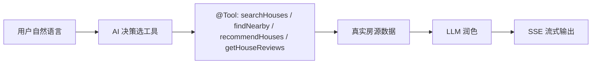
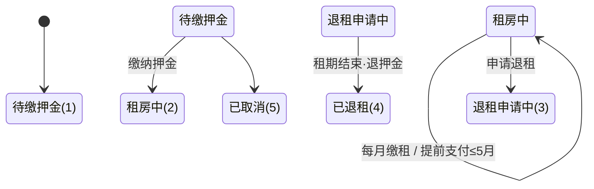

<h1 align="center">🏠 Nest 安居租房后端</h1>

<p align="center">
  <strong>多房东 AI 租房平台 · Spring Boot 3 + LangChain4j 真实 Agent + WebSocket 微信级实时聊天</strong>
</p>

<p align="center">
  
  
  
  
  
  
  
  
</p>


<p align="center">
  <a href="https://github.com/your-org/nest/stargazers"></a>
  <a href="https://github.com/your-org/nest/issues"></a>
  <a href="https://github.com/your-org/nest/commits/main"></a>
</p>


---


## 📌 项目导航


| 项 | 地址 |
|----|------|
| 在线体验 | 待部署后补充 |
| 后端详细设计文档 | [后端详细说明](../docs/后端详细说明.md) |
| 项目迁移方案 | [迁移方案](../docs/迁移方案.md) |
| 前端 · 房东管理端 | 待补充仓库 |
| 前端 · 租客小程序 | 待补充仓库 |


---


## 📖 项目介绍


**Nest（安居）** 是一套**多房东租房平台后端**，面向**租客小程序**与**房东 Web 管理端**双端，覆盖房源发布/浏览、**地图找房**、**AI 智能找房**、收藏、预约看房、评价互动与**微信级实时聊天**的租房撮合业务。两端共用后端 `http://localhost:8080`，采用 **JWT 双通道认证**（租客 `authentication` / 房东 `token`）。

> 🚧 **当前范围**：已实现「房源 → 找房/地图 → 详情 → 预约 → 看房」撮合闭环与 AI/聊天/评价/收藏等旁路能力；
> **签约成交、押金/房租收取、钱包收付** 已完成设计（见根目录 `Plan.md`），为下一阶段开发目标。


---


## ✨ 项目亮点


**🤖 真实 AI Agent（真正 Function Calling）**
基于 LangChain4j `AiServices`，模型**自行决策**调用 `HouseSearchTools` 的只读工具（`searchHouses` / `getHouseDetail` / `findNearby` / `recommendHouses` / `getHouseReviews`）拉取**真实房源数据**（非正则预执行），再组织成自然语言，SSE 流式输出。工具零共享实例状态、天然并发安全；System Prompt 约束助手不捏造房源、不泄露房东电话；写操作（预约/收藏）由用户在前端确认，AI 不越权。


**💬 实时聊天 + 预约联动**
基于 JSR-356（Jakarta WebSocket API）的全双工实时通道，运行于内嵌 Tomcat 容器。握手阶段完成 JWT 校验（要求路径 userId 与 token 一致，防冒充），消息全量落库、离线补齐；预约状态变更（创建/确认/取消）经**同一通道**实时推送，双端状态一致。


**🗺️ 免费地图找房**
OpenStreetMap + Nominatim 零成本方案，**Redis 缓存 30 天 + 1 次/秒限速**（符合第三方使用政策）。经纬度外接矩形粗筛 + Haversine 精排，支持地图选点发布、周边检索与 AI 附近推荐。


**💰 租房成交 + 钱包闭环（🚧 规划中）**
看房结束后确认租房，押金/月租/提前支付（≤5 月）/退租/到期退押金全流程闭环；租金自动入房东钱包，余额与流水同事务、`peer` 双向记账，账实一致。**当前阶段：代码未实现，设计方案见 `Plan.md`**。


---


## 📸 项目演示


> 截图位预留，将对应图片放入 [`../docs/image/`](../docs/image/) 后自动展示（突出核心亮点）。


**🤖 AI 智能找房** — 自然语言 → Function Calling 查真实房源 → 流式回答


<p align="center">
  
</p>


**🗺️ 地图找房** — 视野内房源标记 + 附近检索


<p align="center">
  
</p>


**💬 实时聊天** — 会话列表 + 聊天气泡 + 已读回执


<p align="center">
  
</p>


**📅 预约看房** — 待确认 → 已确认 → 已看房 双端联动


<p align="center">
  
</p>


**🖥️ 房源管理** — 发布 / 编辑 / 上下架 / 多图上传


<p align="center">
  
</p>


**💰 租房成交与钱包** — 订单状态流转 + 钱包余额/流水（🚧 规划中）


<p align="center">
  
</p>


---


## 🛠 技术栈


| 类别 | 技术 | 说明 |
|------|------|------|
| 核心 | Spring Boot 3.4.3 · Java 21 | IoC + 自动配置 |
| ORM | MyBatis 3.0.4 · PageHelper 2.1.0 | SQL 映射 + 分页 |
| 缓存 | Redis 7（Docker 6381） | 地理编码缓存（TTL 30 天）等 |
| 存储 | MinIO（Docker 9012） | 房源图片（S3 兼容） |
| 认证 | JWT 双通道（JJWT 0.12.6） | 租客 / 房东独立密钥、独立拦截器 |
| AI | LangChain4j 1.18.1 | 真实 Function Calling Agent（DeepSeek-V3 @ SiliconFlow / GLM-4-Flash） |
| 聊天 | `nest-chat`（JSR-356 / Netty） | 独立聊天模块，握手 JWT 鉴权，全双工实时双向 |
| 地图 | OpenStreetMap + Nominatim | 免费、Redis 缓存 + 1 req/s 限速 |
| 文档 | Knife4j（OpenAPI 3） | `http://localhost:8080/doc.html` |


---


## 📁 项目结构


```
backend/
├── nest-common/          # 工具类 / Result / BaseContext / JWT 常量与工具 / 地理工具 / 异常
├── nest-pojo/            # Entity / DTO / VO（12 个业务实体：房源、预约、会话、消息、评价、收藏等）
├── nest-ai/              # 🤖 LangChain4j Agent：模型配置 + 只读 @Tool 工具集
├── nest-minio/           # 📦 对象存储：MinioClient 配置 + 上传服务
├── nest-chat/            # 💬 聊天模块：Netty / JSR-356 传输 + PushService 推送
│   └── src/main/java/com/nest/chat/
│       ├── netty/        # Netty 服务端 + 通道处理器
│       ├── jsr356/       # 聊天端点（/ws/chat/{userType}/{userId}）+ 握手鉴权
│       ├── transport/    # 传输层抽象（jsr356 / netty 可切换）
│       ├── core/         # MessageDispatcher 入站路由 + MessageListener SPI
│       └── push/         # PushService 推送 API
├── nest-server/          # Controller / Service / Mapper / 配置 / 拦截器
│   └── src/main/java/com/nest/
│       ├── interceptor/  # JWT 双通道拦截器（user/admin）
│       ├── listener/     # MessageListener 实现（入站消息落库）
│       ├── handler/      # 全局异常处理（统一响应）
│       └── controller/   # 租客 /user/** · 房东 /admin/**
└── sql/                  # nest_rent.sql（12 张表）+ test_data.sql（测试数据）
```


---


## 🚀 快速开始


```bash
# 1. 启动 Docker 基础设施（MySQL / Redis / MinIO，在项目根目录）
cd .. && docker-compose up -d

# 2. 初始化数据库（当前目录 backend/）
mysql -u root -p -P 3309 < sql/nest_rent.sql
mysql -u root -p -P 3309 < sql/test_data.sql     # 可选：演示数据

# 3. 配置开发环境并填入 MySQL / Redis / MinIO / AI API Key
cp nest-server/src/main/resources/application-dev.yml.example \
   nest-server/src/main/resources/application-dev.yml

# 4. 构建 + 启动
mvn clean install -DskipTests
cd nest-server && mvn spring-boot:run   # → http://localhost:8080（API 文档 /doc.html）
```


---


## 🤖 AI 找房


租客在小程序输入自然语言（如「想找杭州 3000 以内、近地铁的房子」），后端经 `AiServices` 构建的 **AI Agent** 自动决定调用 `HouseSearchTools` 的只读工具，取到真实房源后组织成自然语言，通过 SSE 逐字流式返回。多轮对话由 `MessageWindowChatMemory`（最近 20 条）支撑。





## 💬 实时聊天


租客 ↔ 房东一对一实时聊天，通道与推送收敛在独立模块 `nest-chat`（传输层默认 JSR-356，可切 Netty）：握手阶段（`ChatWebSocketConfigurator.modifyHandshake`）完成 JWT 校验并存储可信身份；入站消息经 `MessageDispatcher` 路由后交给 `nest-server` 的 `MessageListener` 实现落库，出站推送统一走 `PushService`。消息全量落 `message` 表（`is_read` 标记），离线期间推送丢弃但消息留存、上线拉取补齐；会话按用户对双向归一（两人只保留一条）；支持已读回执（`read_receipt`）与输入状态（`typing`）转发，心跳保活。模块说明见 [nest-chat/README.md](nest-chat/README.md)。


## 🗺️ 地图找房


前端地图缩放/拖动即查视野内已上架房源标记（`GET /user/house/map`，center + radius 20km）。后端先按**外接矩形**（`GeoUtils.boundingBox`）粗筛，再按距离精排；房东端 `GET /admin/house/map` 查看本人房源标点。地址 ↔ 坐标互转由 Nominatim 完成（`/admin/house/geocode` 与 `/reverse`），Redis 缓存 30 天 + 内置 1 次/秒限速。


## 💰 租房成交与钱包（🚧 规划中）


> 设计方案见根目录 `Plan.md`；当前代码仅实现预约至「已看房(3)」，成交(5) 与后续链路待开发。





---


## 📄 License


MIT © [kamten7](https://github.com/kamten7)
