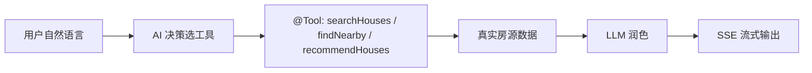

<h1 align="center">🏠 Nest 安居租房后端</h1>

<p align="center">
  <strong>多房东 AI 租房平台 · Spring Boot 3 + LangChain4j 真实 Agent + WebSocket 微信级实时聊天</strong>
</p>

<p align="center">
  
  
  
  
  
  
  
  
</p>

<p align="center">
  <a href="https://github.com/your-org/nest/stargazers"></a>
  <a href="https://github.com/your-org/nest/issues"></a>
  <a href="https://github.com/your-org/nest/commits/main"></a>
</p>

---

## 📌 项目导航

| 项 | 地址 |
|----|------|
| 在线体验 | 待部署后补充 |
| 后端详细设计文档 | [后端详细说明](../docs/后端详细说明.md) |
| 前端 · 房东管理端 | 待补充仓库 |
| 前端 · 租客小程序 | 待补充仓库 |

---

## 📖 项目介绍

**Nest（安居）** 是一套多房东租房平台后端，面向**租客小程序**与**房东 Web 管理端**双端，覆盖房源发布/浏览、地图找房、AI 找房、收藏、预约、评价与实时聊天的全链路租房业务。两端共用后端 `http://localhost:8080`，采用 **JWT 双通道认证**（租客 `authentication` / 房东 `token`）。

---

## ✨ 项目亮点

**🤖 真实 AI Agent（真正 Function Calling）**
基于 LangChain4j `AiServices`，模型**自行决策**调用哪个 `@Tool` 拉取**真实房源数据**（非正则预执行），再组织成自然语言，SSE 流式输出。写操作（预约/收藏）强制「先确认再执行」，工具零共享实例状态，天然并发安全。

**💬 实时聊天 + 预约联动**
WebSocket 长连接 + REST 回补，消息全量落库、离线补齐；预约状态变更（确认/取消）经同一通道实时推送，双端状态一致。

**🗺️ 免费地图找房**
OpenStreetMap + Nominatim 零成本方案，**无并发限制**。Redis 缓存 + 经纬度粗筛 + Haversine 精排，支持地图选点发布、周边检索与 AI 附近推荐。

---

## 📸 项目演示

> 截图位预留，将对应图片放入 [`../docs/image/`](../docs/image/) 后自动展示（突出核心亮点）。

**🤖 AI 智能找房** — 自然语言 → Function Calling 查真实房源 → 流式回答

<p align="center">
  
</p>

**🗺️ 地图找房** — 视野内房源标记 + 附近检索

<p align="center">
  
</p>

**💬 实时聊天** — 会话列表 + 聊天气泡 + 已读回执

<p align="center">
  
</p>

**📅 预约看房** — 待确认 → 已确认 → 已看房 双端联动

<p align="center">
  
</p>

**🖥️ 房源管理** — 发布 / 编辑 / 上下架 / 多图上传

<p align="center">
  
</p>

---

## 🛠 技术栈

| 类别 | 技术 | 说明 |
|------|------|------|
| 核心 | Spring Boot 3.4.3 · Java 21 | IoC + 自动配置 |
| ORM | MyBatis 3.0.4 · PageHelper | SQL 映射 + 分页 |
| 缓存 | Redis 7 | 会话 / 地理编码缓存 |
| 存储 | MinIO | 房源图片（S3 兼容） |
| 认证 | JWT 双通道（JJWT 0.12.6） | 租客 / 房东独立密钥 |
| AI | LangChain4j 1.18.1 | 真实 Function Calling Agent |
| 聊天 | WebSocket（JSR-356） | 微信级实时双向 |
| 地图 | OpenStreetMap + Nominatim | 免费、无并发限制 |
| 文档 | Knife4j（OpenAPI 3） | `http://localhost:8080/doc.html` |

---

## 📁 项目结构

```
backend/
├── nest-common/          # 工具类 / Result / BaseContext / GeoUtils / 常量
├── nest-pojo/            # Entity / DTO / VO（12 实体）
├── nest-server/          # Controller / Service / Mapper / AI / WebSocket
│   └── src/main/java/com/nest/
│       ├── AI/           # 🤖 LangChain4j Agent：模型配置 + @Tool 工具集
│       ├── websocket/    # 💬 聊天端点 + 握手鉴权
│       └── controller/   # 租客 /user/** · 房东 /admin/**
└── sql/                  # 建库脚本 nest_rent.sql + 测试数据
```

---

## 🚀 快速开始

```bash
# 1. 启动 Docker 基础设施（MySQL / Redis / MinIO，在项目根目录）
cd .. && docker-compose up -d

# 2. 初始化数据库（当前目录 backend/）
mysql -u root -p -P 3309 < sql/nest_rent.sql

# 3. 配置开发环境并填入 MySQL / Redis / MinIO / AI API Key
cp nest-server/src/main/resources/application-dev.yml.example \
   nest-server/src/main/resources/application-dev.yml

# 4. 构建 + 启动
mvn clean install -DskipTests
cd nest-server && mvn spring-boot:run   # → http://localhost:8080
```

---

## 🤖 AI 找房

租客在小程序输入自然语言（如「想找杭州 3000 以内、近地铁的房子」），后端经 `AiServices` 构建的 **AI Agent** 自动决定调用 `HouseSearchTools` 的只读工具，取到真实房源后组织成自然语言，通过 SSE 逐字流式返回。多轮对话由 `MessageWindowChatMemory`（最近 20 条）支撑。



## 💬 实时聊天

租客 ↔ 房东一对一实时聊天，WebSocket 长连接 + REST 历史回补。认证走握手 JWT 校验（防冒充），消息全量落 `message` 表，离线期间推送丢弃但消息留存，上线拉取补齐；支持已读回执与输入状态。

## 🗺️ 地图找房

前端地图缩放/拖动即查视野内已上架房源标记（`/user/house/map`）。后端先按**外接矩形**（可走经纬度索引）粗筛，再用 Haversine 精确排序；地址 ↔ 坐标互转由 Nominatim 完成，Redis 缓存 30 天并用 `synchronized` 限速至 1 req/s。

---

## 📄 License

MIT © [kamten7](https://github.com/kamten7)
