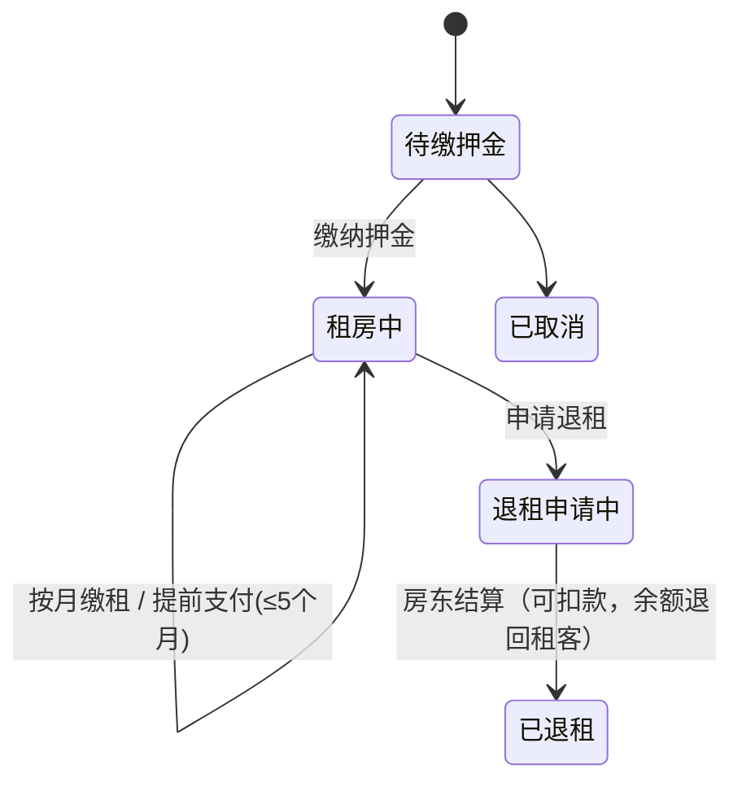

<h1 align="center">🏠 Nest 安居租房平台</h1>

<p align="center">
  <strong>多房东 AI 租房平台 · Spring Boot 3 + LangChain4j 真实 Agent + Netty 实时聊天 + 押金钱包结算闭环</strong>
</p>

<p align="center">
  
  
  
  
  
  
  
  
  
</p>


---


## 📖 项目介绍

**Nest（安居）** 是一套**多房东 AI 租房平台**，面向**租客微信小程序**与**房东 Web 管理端**双端。后端覆盖房源发布与浏览、地图找房、AI 智能找房、收藏、预约看房、评价互动、实时聊天，以及**租房成交、押金/房租收付与钱包结算**的完整撮合闭环。

项目由三个**相互独立的 Git 仓库**组成，各自独立开发、独立提交：

| 端 | 仓库 |
|----|------|
| 服务端（Spring Boot 多模块） | 本仓库 · `backend` |
| 房东管理端（Vue 3 + Element Plus） | `nest-frontend` · `https://github.com/your-org/nest-frontend` |
| 租客端（uni-app 微信小程序） | `nest-miniapp` · `https://github.com/your-org/nest-miniapp` |

两端共用同一套后端 API，采用 **JWT 双通道认证**：租客请求携带 `authentication` 头，房东请求携带 `token` 头，服务端用两把独立密钥分别签发与校验，互不通用。


---


## 🛠 技术栈

| 类别 | 技术 | 说明 |
|------|------|------|
| 核心框架 | Spring Boot 3.4.3 · Java 21 | IoC / 自动配置 / 内嵌 Tomcat |
| 持久层 | MyBatis 3.0.4 · PageHelper 2.1.0 | XML 映射 + 物理分页 |
| 数据库 | MySQL 8.0 | 18 张表，`sql/nest_rent.sql` 一键建库 |
| 连接池 | Druid | 数据源管理 |
| 缓存 | Redis 7 | 地理编码缓存、AI 对话记忆持久化 |
| 对象存储 | MinIO | 房源图片 / 用户头像，双 bucket 分存 |
| 认证 | JJWT 0.12.6 | JWT 双通道，租客与房东独立密钥 + 独立拦截器 |
| AI | LangChain4j 1.18.1 | 真实 Function Calling Agent（DeepSeek-V3） |
| 实时通信 | Netty 4.1.118 | 聊天长连接，握手阶段完成 JWT 鉴权 |
| 参数校验 | Jakarta Validation | DTO 注解 + 全局异常统一处理 |
| 接口文档 | Knife4j（OpenAPI 3） | `http://localhost:8080/doc.html` |
| 地图服务 | OpenStreetMap + Nominatim | 免费方案，Redis 缓存 + 限速 |


---


## ✨ 项目亮点

**🤖 真实 AI Agent，不是正则预执行**
基于 LangChain4j `AiServices`，由模型**自行决策**调用只读 `@Tool`（`searchHouses` / `getHouseDetail` / `findNearby` / `recommendHouses` / `getHouseReviews`）拉取**真实房源数据**，再组织成自然语言 SSE 流式返回。工具零共享状态、天然并发安全；System Prompt 约束不捏造房源、不泄露房东电话；写操作（预约 / 收藏）一律由用户在前端确认，AI 不越权。

**💬 独立聊天模块，传输层可切换**
`nest-chat` 把业务与传输彻底解耦（`MessageTransport` / `MessageDispatcher` / `MessageListener` SPI 三段式），默认走 **Netty**，一行配置即可切回 JSR-356。握手阶段解析 JWT 并与路径上的 userId 强校验，防止冒充连接；消息全量落库，支持离线拉取补齐、已读回执与输入状态。

**💰 押金锁定 + 钱包双向记账**
押金收到后**留在房东钱包内但租期内不可提现**（可提现额度 = 余额 − 名下在租订单押金之和）；退租时房东可扣款作为赔偿，剩余押金经 `transferPay` 退回租客。两笔流水 `peer` 互指、共用同一 `biz_no`，同事务保证账实一致；余额扣减走**单条条件 UPDATE**，天然防并发超扣。

**🗺️ 零成本地图找房**
OpenStreetMap + Nominatim 免费方案，地址与坐标互转带 Redis 缓存；地图检索先用**外接矩形**粗筛，再用 Haversine 精排距离。

**🧩 多模块单向依赖 + SPI 解耦**
8 个 Maven 模块严格单向依赖。跨模块的"反向"需求（例如钱包需要知道业务侧锁定了多少钱）通过**接口声明在使用方、实现放在另一方**的 SPI 解决，既不成环，也让各模块可被独立替换与单测。


---


## 📁 模块结构

```
backend/
├── nest-common/     # 技术底座：Result / PageResult / BaseContext / 常量 / 工具 / 异常
├── nest-pojo/       # 实体 / DTO / VO 统一收口（不随业务模块走）
├── nest-ai/         # AI Agent：模型配置 + 只读 @Tool 工具集 + 对话记忆
├── nest-minio/      # 对象存储：MinioClient 配置 + 上传服务（含 bucket 懒创建）
├── nest-chat/       # 聊天：传输层抽象 + Netty 服务端 + 入站派发 + 出站推送
│   └── src/main/java/com/nest/chat/
│       ├── netty/       # Netty 服务端与通道处理器
│       ├── jsr356/      # JSR-356 端点（/ws/chat/{userType}/{userId}）
│       ├── transport/   # 传输层抽象（netty / jsr356 可切换）
│       ├── core/        # MessageDispatcher 入站路由 + MessageListener SPI
│       └── push/        # PushService 统一推送出口
├── nest-wallet/     # 钱包：余额 / 流水 / 双向记账 / 押金锁定 SPI 声明
├── nest-order/      # 租房订单：确认租房 · 缴押金 · 缴租 · 提前支付 · 退租结算
│   └── task/        # 缴租提醒、超期自动退押金 两个定时任务
├── nest-server/     # 唯一应用入口：Controller / Service / Mapper / 配置 / 拦截器
│   └── src/main/java/com/nest/
│       ├── controller/   # 租客 /user/** · 房东 /admin/**
│       ├── interceptor/  # JWT 双通道拦截器（user / admin）
│       ├── handler/      # 全局异常处理，统一响应结构
│       └── config/       # WebMvc / CORS / 拦截器注册等横切配置
└── sql/             # nest_rent.sql：18 张表 + 房东种子数据，一份脚本建全库
```

依赖方向严格单向：`nest-common` → `nest-pojo` → 各业务模块 → `nest-server`。`nest-ai` / `nest-minio` / `nest-chat` 只放**配置与服务**，Controller 一律收口在 `nest-server`；`nest-wallet` / `nest-order` 则自带 Mapper / Service / Controller，是自包含的业务模块。


---


## 📸 实机展示

> 截图占位已预留，把对应文件放进 [`docs/image/`](docs/image/) 即可自动展示。

### 房东管理端（Web）

**🏠 房东端首页** — 房源总览与数据概览

<p align="center">
  
</p>

**➕ 添加房源** — 房源信息填写 + 地图选点 + 多图上传

<p align="center">
  
</p>

**💬 聊天** — 与租客一对一会话

<p align="center">
  
</p>

**💰 钱包** — 在租押金（不可提现）/ 可提现余额 / 收支流水

<p align="center">
  
</p>

**👤 个人主页** — 房东资料与账号信息

<p align="center">
  
</p>

### 租客端（微信小程序）

**🏠 首页** · **📋 房源详情** · **💬 聊天**

<p align="center">
  
  &nbsp;
  
  &nbsp;
  
</p>

**⭐ 评论** · **👤 个人首页** · **🤖 AI 聊天**

<p align="center">
  
  &nbsp;
  
  &nbsp;
  
</p>


---


## 🚀 启动说明

仓库里只放**模板文件**（`*-example.yml`），真实配置由你自己填、且不进仓库。
统一规则：**复制模板 → 填值 → 删掉模板 → 启动**。

### 第 1 步：准备中间件（两条路，选一条）

**A. 用 Docker 起中间件（推荐，一步到位）**

```bash
# 1) 复制模板为正式文件
cp docker-compose-example.yml docker-compose.yml

# 2) 打开 docker-compose.yml，把 <你的MySQL-root密码> 换成自己的密码

# 3) 删掉模板即完成配置
rm docker-compose-example.yml

# 4) 启动容器（首次会自动执行 sql/nest_rent.sql：建好 19 张表 + 灌入房东种子数据）
docker compose up -d
```

**B. 用本机已装好的 MySQL / Redis / MinIO**
不需要 `docker-compose.yml`，跳过 A，直接做第 2 步（注意端口换成 MySQL `3306` / Redis `6379` / MinIO `9000`）。

### 第 2 步：配置后端

```bash
# 1) 复制模板为正式文件（application-dev.yml 已被 gitignore，不会进仓库）
cp nest-server/src/main/resources/application-dev-example.yml \
   nest-server/src/main/resources/application-dev.yml

# 2) 填值：MySQL 密码必填；Redis / MinIO / AI Key / 微信凭证按需填
#    走 A 方案时，这里的数据库密码要与 docker-compose.yml 的 MYSQL_ROOT_PASSWORD 一致

# 3) 删掉模板即完成配置
rm nest-server/src/main/resources/application-dev-example.yml
```

### 第 3 步：构建并启动

```bash
mvn clean install -DskipTests
cd nest-server && mvn spring-boot:run
```

> 需要清库重来时再手动跑（⚠️ 该脚本自带 `DROP DATABASE`，会删库重建、数据不可逆）：
>
> ```bash
> docker exec -i nest_mysql mysql -uroot -p'<你的密码>' --default-character-set=utf8mb4 < sql/nest_rent.sql
> ```

启动后：

| 地址 | 说明 |
|------|------|
| `http://localhost:8080` | 后端 API |
| `http://localhost:8080/doc.html` | 接口文档（Knife4j） |
| `ws://localhost:8081/ws/chat/{userType}/{userId}?token=` | 聊天长连接（Netty，独立端口） |


---


## 🔄 业务流程

租客从找房到退租的完整链路：

1. **房东发布房源** —— 填写房源信息、地图选点定位、上传多张图片
2. **租客找房** —— 列表搜索 / 地图视野检索 / AI 自然语言找房，进入房源详情
3. **预约看房** —— 租客发起预约 → 房东确认 → 线下看房 → 房东标记「已看房」
4. **确认租房** —— 租客基于「已看房」的预约确认租房，后端生成订单并按房源计算租金与押金（押一付一）
5. **缴纳押金** —— 押金进入房东钱包，但**租期内锁定不可提现**
6. **按期缴租** —— 逐月缴租或提前支付（最多 5 个月）；到期前 3 天系统自动提醒
7. **申请退租** —— 租客发起退租，房东结算：可扣款作为赔偿，剩余押金退回租客钱包
8. **超期兜底** —— 若租期结束后房东超过 7 天未结算，定时任务自动全额退还押金

订单状态流转：



> 状态码：`1 待缴押金` · `2 租房中` · `3 退租申请中` · `4 已退租` · `5 已取消`


---


## 📄 License

MIT © [kamten7](https://github.com/kamten7)
