<h1 align="center">🏠 Nest 安居租房平台</h1>

<p align="center">
  <strong>多房东 AI 租房平台 · LangChain4j 真实 Agent 找房 · Netty 长连接实时聊天 · 押金锁定与钱包结算闭环</strong>
</p>

<p align="center">
  
  
  
  
  
  
  
  
  
  
  
</p>

<p align="center">
  <a href="#-核心亮点">核心亮点</a> ·
  <a href="#-系统架构">系统架构</a> ·
  <a href="#-功能清单">功能清单</a> ·
  <a href="#-快速开始">快速开始</a> ·
  <a href="#-接口一览">接口一览</a> ·
  <a href="#-实机展示">实机展示</a>
</p>


---


## 📖 项目介绍

**Nest（安居）** 是一套**多房东 AI 租房平台**，覆盖**租客微信小程序**与**房东 Web 管理端**双端。后端实现了从「房源发布 → 找房 → 预约看房 → 确认租房 → 缴押金 → 按期缴租 → 申请退租 → 退租结算」的完整撮合闭环，并在两条纵向上做了深度实现：**用真实 Function Calling 做 AI 找房 Agent**，以及**用 Netty 自建长连接做实时聊天**。

项目由三个**相互独立的 Git 仓库**组成，各自独立开发、独立提交：

| 端 | 仓库 | 技术栈 |
|----|------|--------|
| 服务端 | [**Nest_Backend**](https://github.com/kamten7/Nest_Backend)（本仓库） | Spring Boot 3 多模块 · MyBatis · MySQL · Redis · Netty |
| 房东管理端 | [Nest_frontend](https://github.com/kamten7/Nest_frontend) | Vue 3 + TypeScript + Element Plus |
| 租客端 | [Nest_uniapp](https://github.com/kamten7/Nest_uniapp) | uni-app + Vue 3 + Pinia（微信小程序） |

两端共用同一套后端 API，采用 **JWT 双通道认证**：租客请求携带 `authentication` 头，房东请求携带 `token` 头，服务端用两把**独立密钥**分别签发与校验，互不通用——即使租客端 token 泄露，也无法伪造成房东身份。


---


## ✨ 核心亮点

### 🥇 亮点一：LangChain4j 真实 AI Agent 找房

> 不是「拼 prompt → 正则抠参数 → 查库 → 拼回答」的伪 Agent，而是让模型**自己决定调不调工具、调哪个、调几次**。

基于 LangChain4j 的 `AiServices` 声明式 Agent，由 **DeepSeek-V3** 驱动，注册 5 个**只读** `@Tool` 供模型自主调用：

| 工具 | 作用 |
|------|------|
| `searchHouses(city, district, keyword)` | 按城市/区域/关键词搜索房源 |
| `getHouseDetail(houseId)` | 查询单个房源详情（户型、朝向、要求等） |
| `findNearby(lat, lng, radiusMeters)` | 按坐标查附近房源 |
| `getHouseReviews(houseId, limit)` | 查看某房源的住客评论 |
| `recommendHouses(budget, city, preferences, count)` | 按预算与偏好智能推荐 |

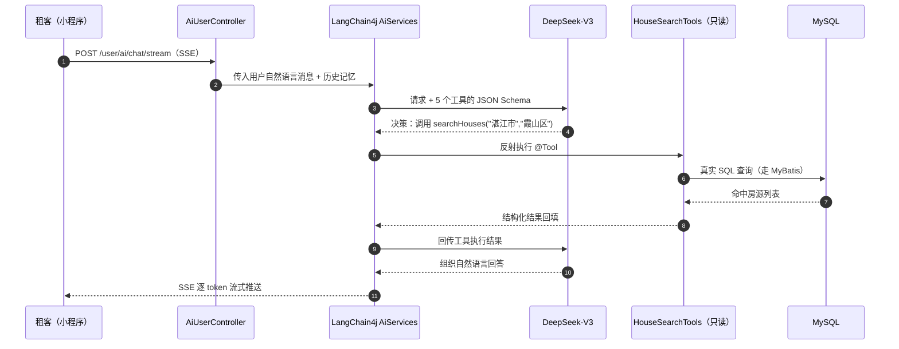
```mermaid
sequenceDiagram
  autonumber
  participant U as 租客（小程序）
  participant C as AiUserController
  participant S as LangChain4j AiServices
  participant M as DeepSeek-V3
  participant T as HouseSearchTools（只读）
  participant DB as MySQL

  U->>C: POST /user/ai/chat/stream（SSE）
  C->>S: 传入用户自然语言消息 + 历史记忆
  S->>M: 请求 + 5 个工具的 JSON Schema
  M-->>S: 决策：调用 searchHouses("湛江市","霞山区")
  S->>T: 反射执行 @Tool
  T->>DB: 真实 SQL 查询（走 MyBatis）
  DB-->>T: 命中房源列表
  T-->>S: 结构化结果回填
  S->>M: 回传工具执行结果
  M-->>S: 组织自然语言回答
  S-->>U: SSE 逐 token 流式推送
```

**工程上做了哪些约束**

- **工具零共享状态** —— 每个 `@Tool` 都是无实例可变状态的纯查询方法，天然并发安全，无需加锁。
- **只读工具集** —— 工具层只暴露查询，模型能力再强也无法通过工具链改写数据。
- **写操作人为闸门** —— 预约看房、收藏这类写操作**不开放给模型**，一律由前端弹出确认后走正常 REST 接口，AI 不越权。
- **防幻觉护栏** —— System Prompt 明确约束「不得捏造不存在的房源」「不得泄露房东联系方式」，并要求回答必须基于工具返回的真实数据。
- **记忆持久化** —— 多轮对话记忆落在 Redis，配套 `GET /user/ai/memory`（查看）与 `DELETE /user/ai/memory`（清空）便于调试与会话重置。

> 关键代码：`nest-ai/src/main/java/com/nest/ai/tools/HouseSearchTools.java`、`nest-ai/src/main/java/com/nest/ai/service/impl/AiUserServiceImpl.java`

---

### 🥈 亮点二：Netty 自建长连接 + 传输层可插拔

> 聊天模块把**业务逻辑**与**传输实现**彻底解耦，默认跑 Netty，改一行配置即可切回 JSR-356。

`nest-chat` 采用**三段式 SPI** 设计，业务侧只依赖抽象，不感知底层是 Netty 还是 Servlet 容器：

| 抽象 | 职责 |
|------|------|
| `MessageTransport` | 传输层接口：连接的建立、发送、关闭 |
| `MessageDispatcher` | 入站路由：把收到的消息分发到对应业务监听器 |
| `MessageListener` | 业务 SPI：由业务模块实现「收到消息后做什么」 |

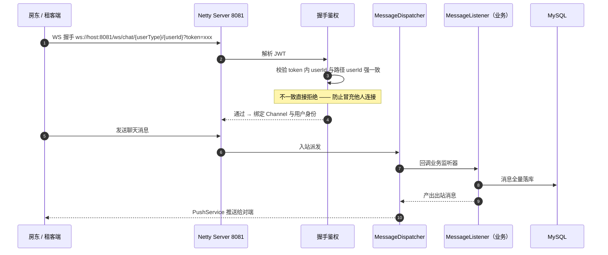
```mermaid
sequenceDiagram
  autonumber
  participant Client as 房东 / 租客端
  participant N as Netty Server 8081
  participant A as 握手鉴权
  participant D as MessageDispatcher
  participant L as MessageListener（业务）
  participant DB as MySQL

  Client->>N: WS 握手 ws://host:8081/ws/chat/{userType}/{userId}?token=xxx
  N->>A: 解析 JWT
  A->>A: 校验 token 内 userId 与路径 userId 强一致
  Note over A: 不一致直接拒绝 —— 防止冒充他人连接
  A-->>N: 通过 → 绑定 Channel 与用户身份
  Client->>N: 发送聊天消息
  N->>D: 入站派发
  D->>L: 回调业务监听器
  L->>DB: 消息全量落库
  L-->>D: 产出出站消息
  D-->>Client: PushService 推送给对端
```

**做了哪些实际能力**

- **握手即鉴权** —— 在 WebSocket 握手阶段完成 JWT 解析，并把 token 中的 `userId` 与连接路径上的 `userId` **强制比对**，杜绝「用 A 的 token 连 B 的通道」这类冒充。
- **一行切传输层** —— `nest.websocket.implementation: netty | jsr356`，业务代码零改动。
- **消息可靠投递** —— 消息**全量落库**；支持离线消息拉取补齐、已读回执、输入中状态。
- **统一出站出口** —— 所有推送收敛到 `PushService`，避免业务代码里散落 Channel 操作。
- **独立端口** —— Netty 监听 `8081`，与 HTTP `8080` 分离，互不影响。

> 关键代码：`nest-chat/src/main/java/com/nest/chat/{netty,jsr356,transport,core,push}/`

---

### 🥉 亮点三：押金锁定 + 钱包双向记账

- **押金锁定机制** —— 押金收到后**留在房东钱包内，但租期内不可提现**。可提现额度 = `余额 − 名下所有在租订单押金之和`，退租结算后自动释放。
- **双向记账** —— 一次资金转移生成**两笔流水**（房东 / 租客），两笔流水的 `peer` 字段互指、共用同一个 `biz_no`，同一事务内写入，保证账实一致、可追溯。
- **防并发超扣** —— 余额扣减走**单条条件 UPDATE**（`... SET balance = balance - ? WHERE balance >= ?`），由数据库行锁保证原子性，从根上杜绝并发场景下的余额超额扣减，无需应用层分布式锁。
- **退租结算兜底** —— 租客申请退租后房东可扣款作为赔偿，剩余押金退回租客；若房东超过 **7 天**未结算，定时任务自动全额退还，防止押金被长期占用。

### 🗺️ 亮点四：零成本地图找房

- 采用 **OpenStreetMap + Nominatim** 免费方案，地址与经纬度互转带 **Redis 缓存 + 限速**，不依赖任何付费地图 Key。
- 地图视野检索先按**外接矩形**做粗筛（走索引），再用 **Haversine 公式**精排真实距离，避免全表算距离。

### 🧩 亮点五：多模块单向依赖 + SPI 反向解耦

- **8 个 Maven 模块**严格单向依赖，任何模块都不回指上层，从架构上杜绝循环依赖。
- 跨模块的「反向」需求（如**钱包需要知道业务侧锁定了多少钱**）通过 **SPI** 解决：**接口声明在钱包侧、实现放在订单侧**，钱包用 `@Autowired(required = false)` 字段注入可选依赖。既不成环，也保证钱包可脱离订单独立编译与单测。

### 🔐 亮点六：零真实凭据的仓库

- 所有敏感配置（数据库口令、JWT 密钥、AI Key、微信凭证）只存在于本地 `application-dev.yml`，该文件已 `.gitignore`。
- 仓库内只提供 `*-example.yml` **模板文件**，全部使用占位符，并在注释里逐项说明「用途 / 是否必改 / 改完要同步哪里」，使用者复制模板 → 填值 → 删除模板即可跑通。


---


## 🧱 系统架构

### 模块依赖

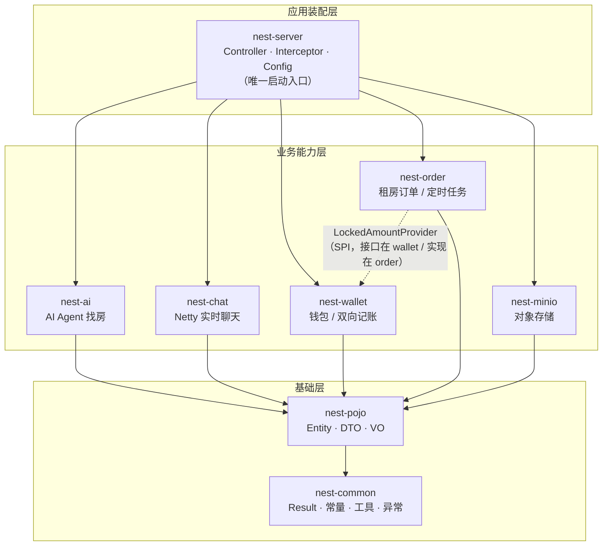
```mermaid
graph TD
  subgraph APP["应用装配层"]
    S["nest-server<br/>Controller · Interceptor · Config<br/>（唯一启动入口）"]
  end

  subgraph BIZ["业务能力层"]
    AI["nest-ai<br/>AI Agent 找房"]
    CH["nest-chat<br/>Netty 实时聊天"]
    WA["nest-wallet<br/>钱包 / 双向记账"]
    OR["nest-order<br/>租房订单 / 定时任务"]
    MI["nest-minio<br/>对象存储"]
  end

  subgraph BASE["基础层"]
    PO["nest-pojo<br/>Entity · DTO · VO"]
    CO["nest-common<br/>Result · 常量 · 工具 · 异常"]
  end

  S --> AI
  S --> CH
  S --> WA
  S --> OR
  S --> MI
  AI --> PO
  CH --> PO
  WA --> PO
  OR --> PO
  MI --> PO
  PO --> CO
  OR -. "LockedAmountProvider（SPI，接口在 wallet / 实现在 order）" .-> WA
```

**依赖方向严格单向**：`nest-common` → `nest-pojo` → 各业务模块 → `nest-server`。

- `nest-ai` / `nest-minio` / `nest-chat` 只放**配置与服务**，Controller 一律收口在 `nest-server`；
- `nest-wallet` / `nest-order` 则自带 Mapper / Service / Controller，是**自包含的业务模块**；
- 唯一一处「反向依赖」通过 SPI 化解（见上文亮点五），架构上仍无环。

### 技术栈

| 类别 | 技术 | 说明 |
|------|------|------|
| 核心框架 | Spring Boot 3.4.3 · Java 21 | IoC / 自动配置 / 内嵌 Tomcat |
| 持久层 | MyBatis 3.0.4 · PageHelper 2.1.0 | XML 映射 + 物理分页 |
| 数据库 | MySQL 8.0 | **19 张表**，`sql/nest_rent.sql` 一键建库 |
| 连接池 | Druid | 数据源管理 · 连接池监控 |
| 缓存 | Redis 7 | 地理编码缓存、AI 对话记忆持久化 |
| 对象存储 | MinIO | 房源图片 / 用户头像，双 bucket 分存 |
| 认证 | JJWT 0.12.6 | JWT 双通道，租客与房东独立密钥 + 独立拦截器 |
| AI | LangChain4j 1.18.1 | 真实 Function Calling Agent（DeepSeek-V3） |
| 实时通信 | Netty 4.1.118 | 聊天长连接，握手阶段完成 JWT 鉴权 |
| 参数校验 | Jakarta Validation | DTO 注解 + 全局异常统一处理 |
| 接口文档 | Knife4j（OpenAPI 3） | `http://localhost:8080/doc.html` |
| 地图服务 | OpenStreetMap + Nominatim | 免费方案，Redis 缓存 + 限速 |


---


## 💡 功能清单

### 房东管理端（Web）

| 模块 | 能力 |
|------|------|
| 房源管理 | 发布 / 编辑 / 上下架房源，地图选点定位，多图上传（MinIO） |
| 预约管理 | 查看租客预约，确认 / 完成 / 取消看房 |
| 租房订单 | 确认租房、查看在租订单、查看缴租进度 |
| 钱包 | 余额与**在租锁定押金**分别展示，提现，收支流水 |
| 退租结算 | 审批退租申请，可扣款作为赔偿，剩余押金退回租客 |
| 实时聊天 | 与租客一对一会话（Netty 长连接） |
| 账号 | 登录 / 注册 / 个人资料维护 |

### 租客端（微信小程序）

| 模块 | 能力 |
|------|------|
| 找房 | 关键词搜索、条件筛选、**地图视野找房**、**AI 自然语言找房** |
| 房源详情 | 图片轮播、户型/朝向/配套、房东信息、住客评论 |
| 收藏与评价 | 收藏房源、发布与删除评论、评论点赞 |
| 预约看房 | 发起预约、查看预约进度 |
| 租房下单 | 基于「已看房」的预约确认租房，缴纳押金 |
| 缴租 | 逐月缴租、**提前支付（最多 5 个月）** |
| 退租 | 发起退租申请、查看结算结果 |
| 钱包 | 余额、收支流水、提现 |
| 实时聊天 | 与房东一对一聊天、离线消息补齐、已读回执 |
| AI 助手 | SSE 流式对话，多轮记忆 |

### 平台能力

JWT 双通道认证 · 统一响应结构（`Result` / `PageResult`）· 全局异常处理 · 定时任务（缴租提醒 / 超期自动退押金 / 待缴押金超时回收）· 多级权限拦截


---


## 🔄 核心业务流程

租客从找房到退租的完整链路：

1. **房东发布房源** —— 填写房源信息、地图选点定位、上传多张图片
2. **租客找房** —— 列表搜索 / 地图视野检索 / **AI 自然语言找房**，进入房源详情
3. **预约看房** —— 租客发起预约 → 房东确认 → 线下看房 → 房东标记「已看房」
4. **确认租房** —— 租客基于「已看房」的预约确认租房，后端生成订单并按房源计算租金与押金（押一付一）
5. **缴纳押金** —— 押金进入房东钱包，但**租期内锁定不可提现**
6. **按期缴租** —— 逐月缴租或提前支付（最多 5 个月）；到期前 3 天系统自动提醒
7. **申请退租** —— 租客发起退租，房东结算：可扣款作为赔偿，剩余押金退回租客钱包
8. **超期兜底** —— 若租客申请退租后房东超过 **7 天**未结算，定时任务自动全额退还押金

订单状态流转：

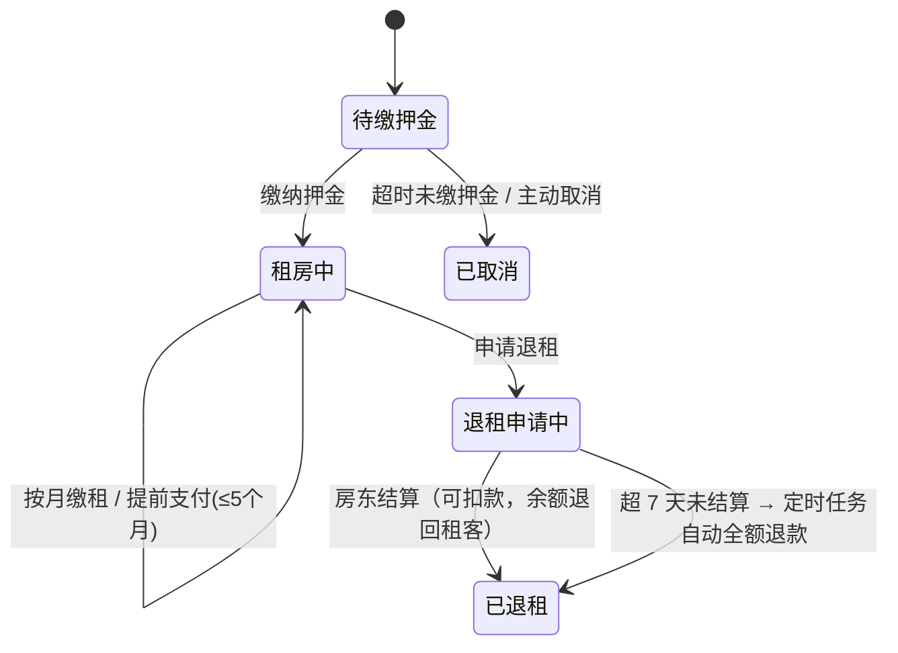
```mermaid
stateDiagram-v2
  [*] --> 待缴押金
  待缴押金 --> 租房中: 缴纳押金
  租房中 --> 租房中: 按月缴租 / 提前支付(≤5个月)
  租房中 --> 退租申请中: 申请退租
  退租申请中 --> 已退租: 房东结算（可扣款，余额退回租客）
  退租申请中 --> 已退租: 超 7 天未结算 → 定时任务自动全额退款
  待缴押金 --> 已取消: 超时未缴押金 / 主动取消
```

> 状态码：`1 待缴押金` · `2 租房中` · `3 退租申请中` · `4 已退租` · `5 已取消`


---


## 📁 目录结构

```
backend/
├── nest-common/     # 技术底座：Result / PageResult / BaseContext / 常量 / 工具 / 异常
├── nest-pojo/       # 实体 / DTO / VO 统一收口（不随业务模块走）
├── nest-ai/         # AI Agent：模型配置 + 只读 @Tool 工具集 + 对话记忆
├── nest-minio/      # 对象存储：MinioClient 配置 + 上传服务（含 bucket 懒创建）
├── nest-chat/       # 聊天：传输层抽象 + Netty 服务端 + 入站派发 + 出站推送
│   └── src/main/java/com/nest/chat/
│       ├── netty/       # Netty 服务端与通道处理器
│       ├── jsr356/      # JSR-356 端点（/ws/chat/{userType}/{userId}）
│       ├── transport/   # 传输层抽象（netty / jsr356 可切换）
│       ├── core/        # MessageDispatcher 入站路由 + MessageListener SPI
│       └── push/        # PushService 统一推送出口
├── nest-wallet/     # 钱包：余额 / 流水 / 双向记账 / 押金锁定 SPI 声明
├── nest-order/      # 租房订单：确认租房 · 缴押金 · 缴租 · 提前支付 · 退租结算
│   └── task/        # 缴租提醒、超期自动退押金 两个定时任务
├── nest-server/     # 唯一应用入口：Controller / Service / Mapper / 配置 / 拦截器
│   └── src/main/java/com/nest/
│       ├── controller/   # 租客 /user/** · 房东 /admin/**
│       ├── interceptor/  # JWT 双通道拦截器（user / admin）
│       ├── handler/      # 全局异常处理，统一响应结构
│       └── config/       # WebMvc / CORS / 拦截器注册等横切配置
├── docs/            # 技术文档 · 业务流程图 · 实机截图
└── sql/             # nest_rent.sql：19 张表 + 房东种子数据，一份脚本建全库
```


---


## 🚀 快速开始

仓库里只放**模板文件**（`*-example.yml`），真实配置由你自己填、且不进仓库。
统一规则：**复制模板 → 填值 → 删掉模板 → 启动**。

### 环境要求

| 依赖 | 版本 |
|------|------|
| JDK | 21+ |
| Maven | 3.8+ |
| MySQL | 8.0 |
| Redis | 7 |
| MinIO | 任意近期版本（可选，不跑图片上传可不配） |

### 第 1 步：准备中间件（两条路，选一条）

**A. 用 Docker 起中间件（推荐，一步到位）**

```bash
# 1) 复制模板为正式文件
cp docker-compose-example.yml docker-compose.yml

# 2) 打开 docker-compose.yml，把 <你的MySQL-root密码> 换成自己的密码
#    （Redis / MinIO 用模板里的默认值即可直接跑通）

# 3) 删掉模板即完成配置
rm docker-compose-example.yml

# 4) 启动容器（首次会自动执行 sql/nest_rent.sql：建好 19 张表 + 灌入房东种子数据）
docker compose up -d
```

> ⚠️ **改 MySQL 密码的坑**：MySQL 官方镜像**只在数据卷为空、容器首次初始化时**读取 `MYSQL_ROOT_PASSWORD`。容器若已初始化过，只改 `docker-compose.yml` 是**不生效**的，必须登录进容器执行 `ALTER USER 'root'@'%' IDENTIFIED BY '新密码';`，或 `docker compose down -v` 连数据卷一起删掉重建（会清空数据）。模板顶部有完整说明。

**B. 用本机已装好的 MySQL / Redis / MinIO**

不需要 `docker-compose.yml`，跳过 A，直接做第 2 步（注意端口换成 MySQL `3306` / Redis `6379` / MinIO `9000`）。

### 第 2 步：配置后端

```bash
# 1) 复制模板为正式文件（application-dev.yml 已被 gitignore，不会进仓库）
cp nest-server/src/main/resources/application-dev-example.yml \
   nest-server/src/main/resources/application-dev.yml

# 2) 填值：
#    🔴 必填：nest.jwt.admin-secret-key / user-secret-key（随便填两个不同的 32 位随机串）
#    🔴 必填：nest.datasource.password（走 A 方案时，要与 docker-compose.yml 的 MYSQL_ROOT_PASSWORD 一致）
#    🟡 选填：Redis 密码、MinIO、AI Key、微信凭证（不填只影响对应功能，不影响启动）

# 3) 删掉模板即完成配置
rm nest-server/src/main/resources/application-dev-example.yml
```

> 模板里每个配置项都写了「用途 / 是否必改 / 改完要同步哪里」，照着填即可。

### 第 3 步：构建并启动

```bash
mvn clean install -DskipTests
cd nest-server && mvn spring-boot:run
```

> 需要清库重来时再手动跑（⚠️ 该脚本自带 `DROP DATABASE`，会删库重建、数据不可逆）：
>
> ```bash
> docker exec -i nest_mysql mysql -uroot -p'<你的密码>' --default-character-set=utf8mb4 < sql/nest_rent.sql
> ```

启动后：

| 地址 | 说明 |
|------|------|
| `http://localhost:8080` | 后端 API |
| `http://localhost:8080/doc.html` | 接口文档（Knife4j） |
| `ws://localhost:8081/ws/chat/{userType}/{userId}?token=` | 聊天长连接（Netty，独立端口） |

### 第 4 步：跑单测（可选）

```bash
mvn test    # 81 个单元测试
```


---


## 🔌 接口一览

接口按调用方角色划分命名空间，由两个独立的 JWT 拦截器分别守卫：

| 命名空间 | 调用方 | 认证头 |
|----------|--------|--------|
| `/user/**` | 租客端（小程序） | `authentication` |
| `/admin/**` | 房东端（Web） | `token` |

部分核心接口：

| 接口 | 方法 | 说明 |
|------|------|------|
| `/user/ai/chat/stream` | POST | **AI 找房对话（SSE 流式）** |
| `/user/ai/memory` | GET / DELETE | 查看 / 清空 AI 对话记忆 |
| `/user/chat/conversations` | GET | 会话列表 |
| `/user/chat/messages/{conversationId}` | GET | 拉取历史消息（支持离线补齐） |
| `/user/chat/unread` | GET | 未读计数 |
| `/admin/chat/**` | — | 房东侧同名聊天接口 |
| `/user/house/list` · `/detail/{id}` · `/map` | GET | 房源列表 / 详情 / 地图检索（公开） |

完整接口文档：启动后访问 `http://localhost:8080/doc.html`。


---


## 📚 项目文档

| 文档 | 内容 |
|------|------|
| [后端核心技术手册](docs/后端核心技术手册.md) | 各模块核心技术实现详解（[PDF 版](docs/后端核心技术手册.pdf)） |
| [业务全流程图](docs/业务全流程图.html) | 全链路业务流转可视化 |


---


## 📸 实机展示

### 房东管理端（Web）

**🏠 房东端首页** — 房源总览与数据概览

<p align="center">
  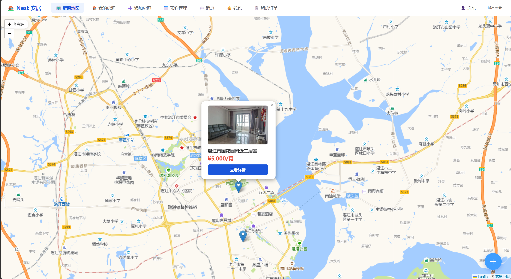
</p>

**📋 房源管理 & ➕ 添加房源** — 房源列表管理 / 信息填写 + 地图选点 + 多图上传

<p align="center">
  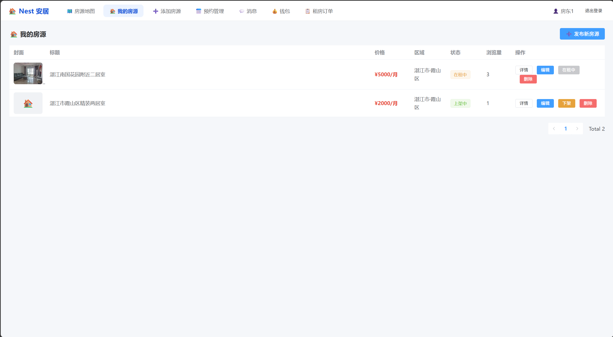
  &nbsp;
  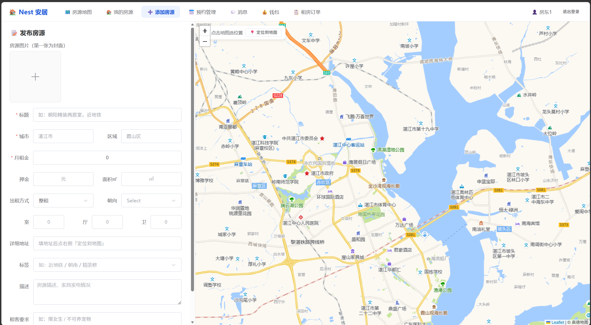
</p>

**📅 预约管理** — 查看并处理租客的看房预约

<p align="center">
  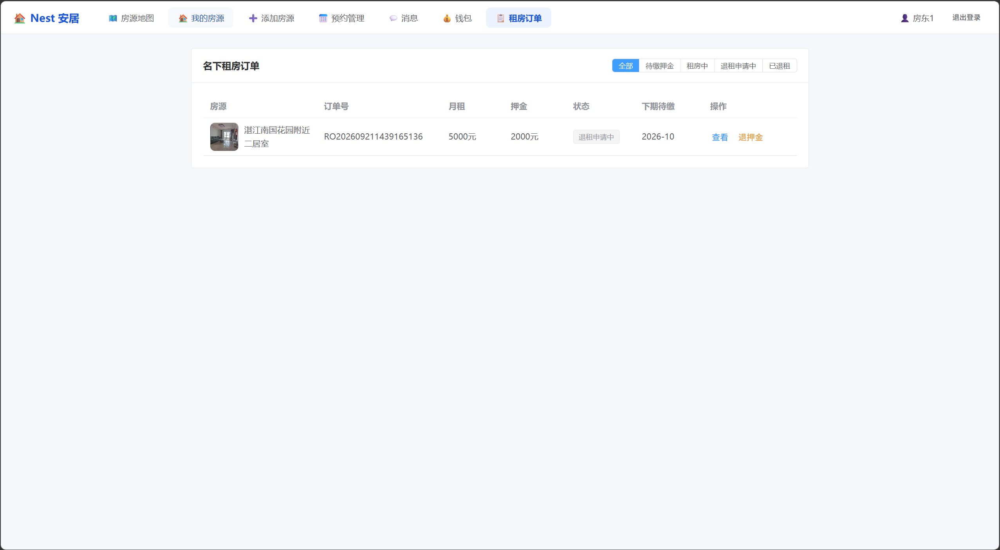
</p>

**💰 钱包** — 在租押金（不可提现）/ 可提现余额 / 收支流水

<p align="center">
  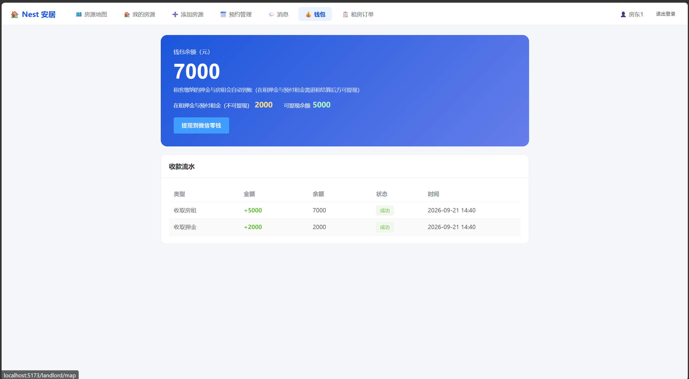
</p>

**💬 聊天 & 👤 个人主页** — 与租客一对一会话 / 房东资料维护

<p align="center">
  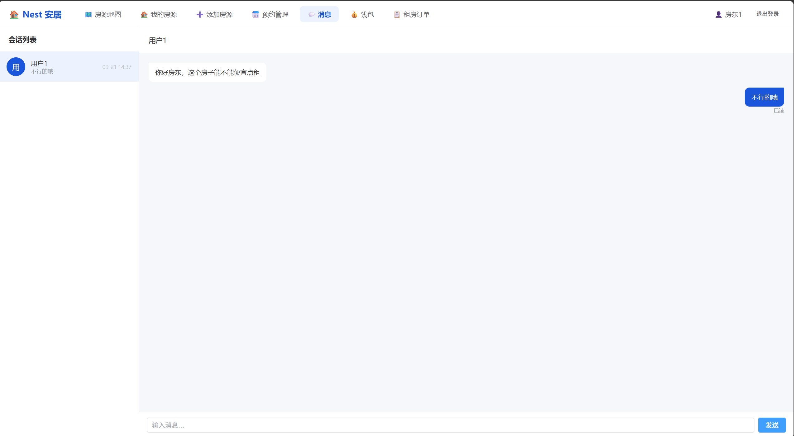
  &nbsp;
  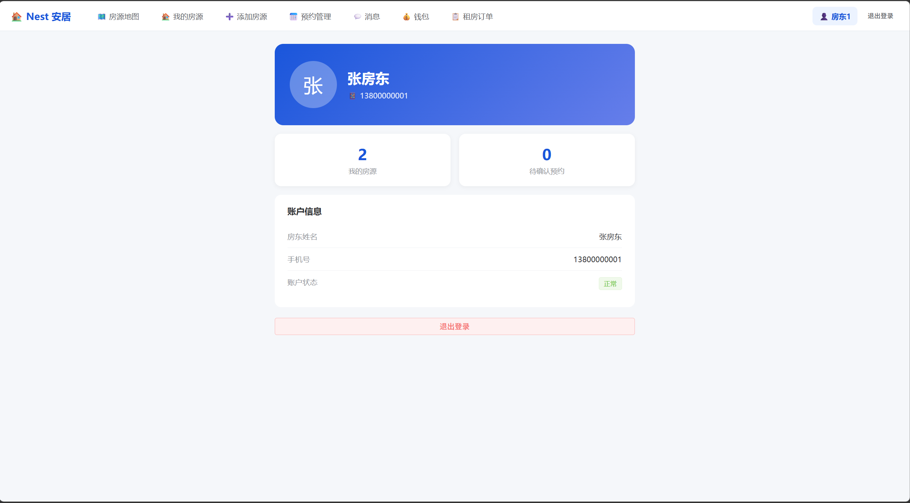
</p>

### 租客端（微信小程序）

**🏠 首页 · 🗺️ 地图找房 · 📋 房源详情**

<p align="center">
  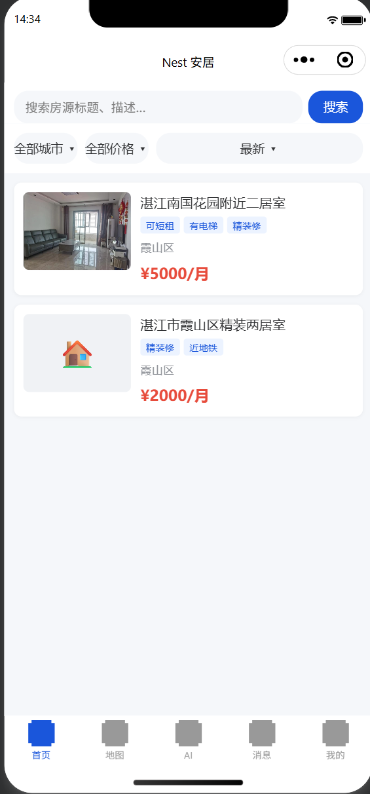
  &nbsp;
  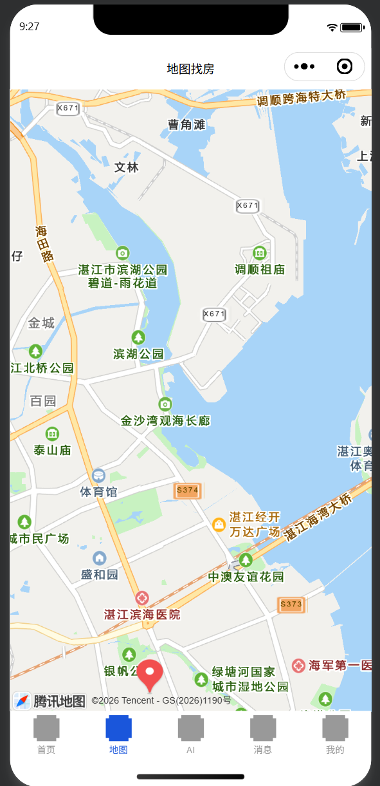
  &nbsp;
  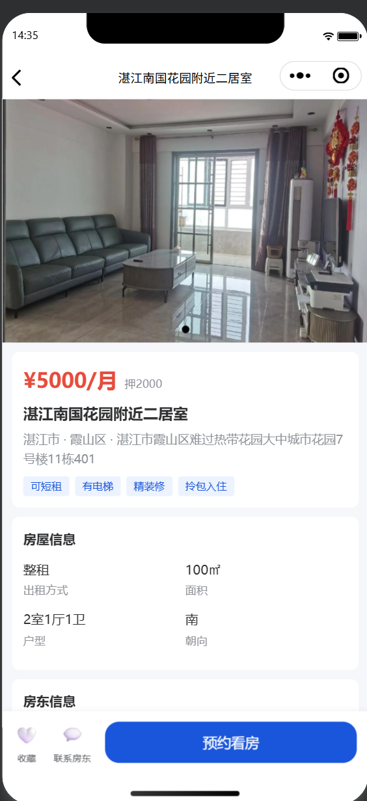
</p>

**🤖 AI 聊天 · 💬 私聊 · ⭐ 评论**

<p align="center">
  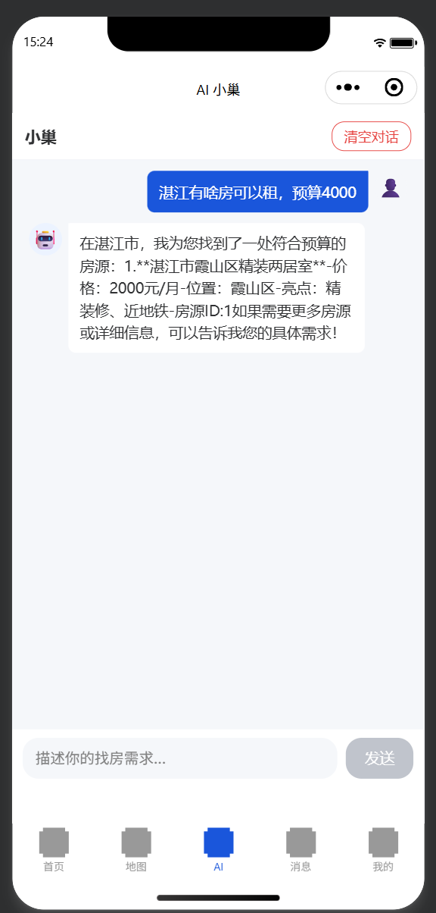
  &nbsp;
  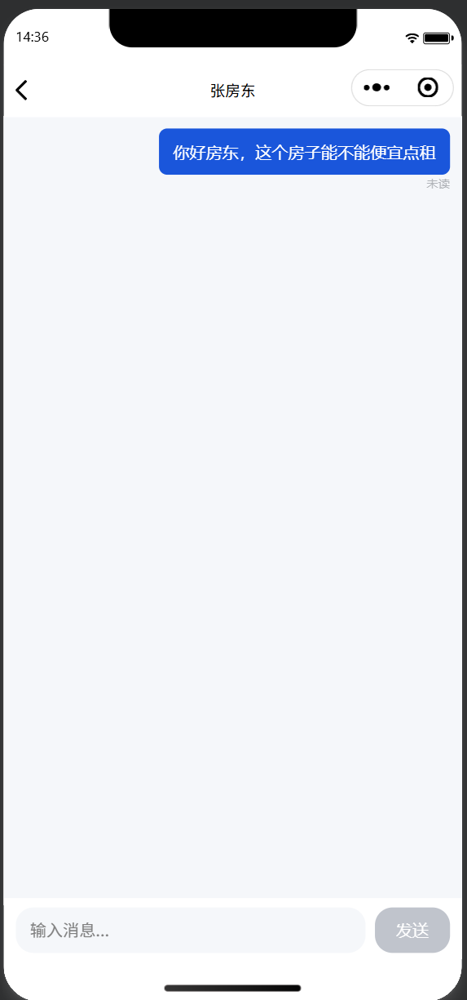
  &nbsp;
  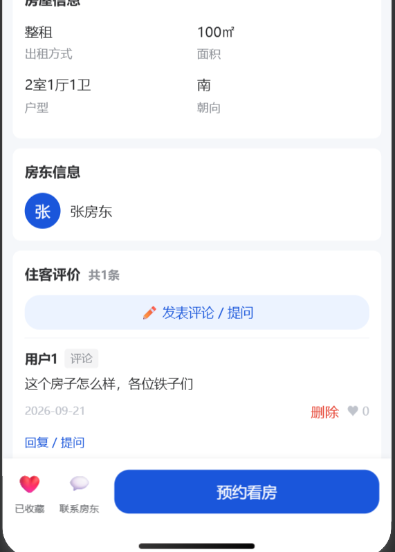
</p>

**📅 预约列表 · 💰 钱包 · 💸 提现**

<p align="center">
  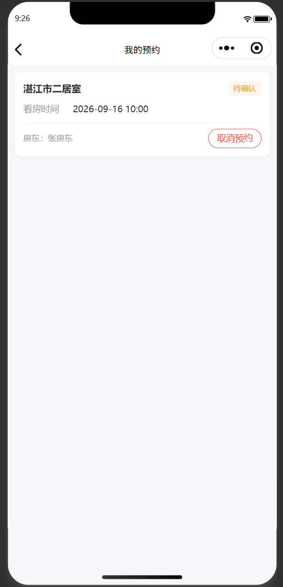
  &nbsp;
  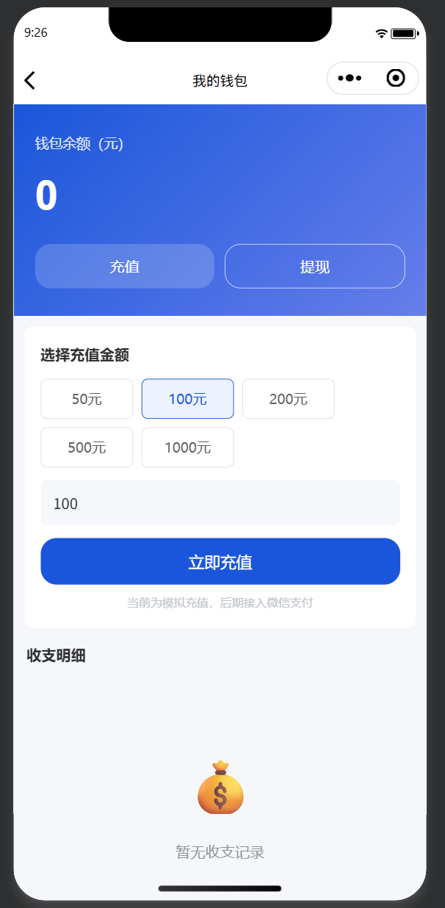
  &nbsp;
  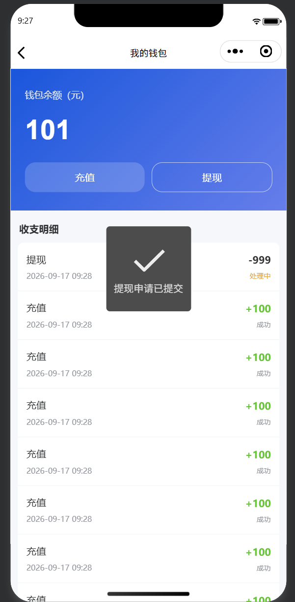
</p>

**👤 个人页面**

<p align="center">
  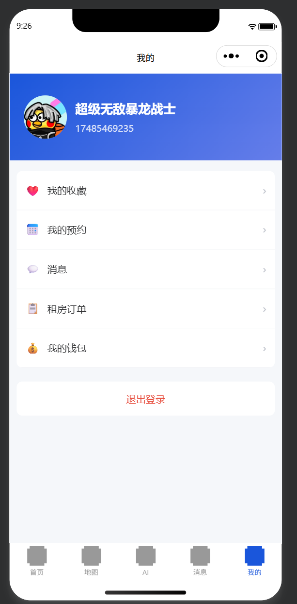
</p>


---


## 🧪 工程质量

| 项目 | 说明 |
|------|------|
| 单元测试 | **81 个**，覆盖钱包锁定/提现、退租退款、分页边界、房源状态流转、租客资料等核心逻辑 |
| 模块化 | 8 个 Maven 模块单向依赖，无循环依赖 |
| 配置安全 | 敏感配置全部外置到 gitignore 的本地文件，仓库内只有占位符模板 |
| 异常处理 | 全局异常处理器统一收敛，响应结构一致（`Result` / `PageResult`） |
| 边界防护 | 分页参数 clamp、状态流转条件 UPDATE 守卫、删房行级锁防竞态 |


---


## 📄 License

MIT © [kamten7](https://github.com/kamten7)
